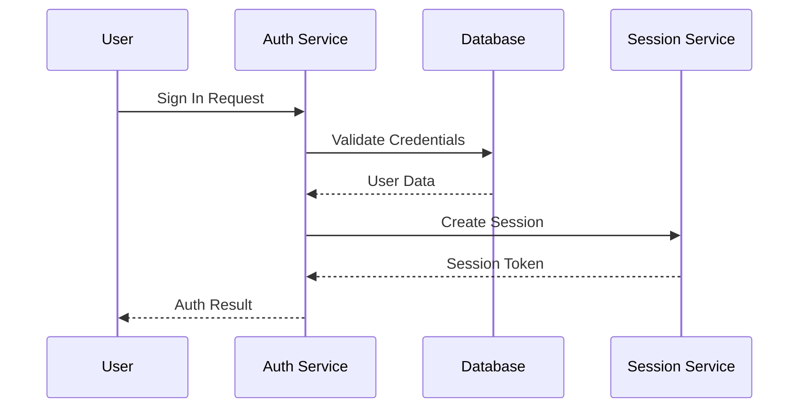
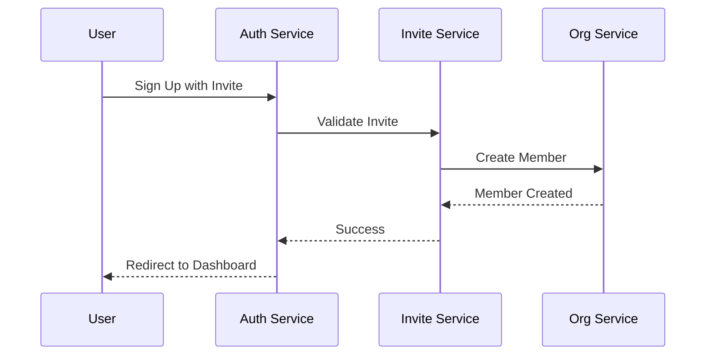
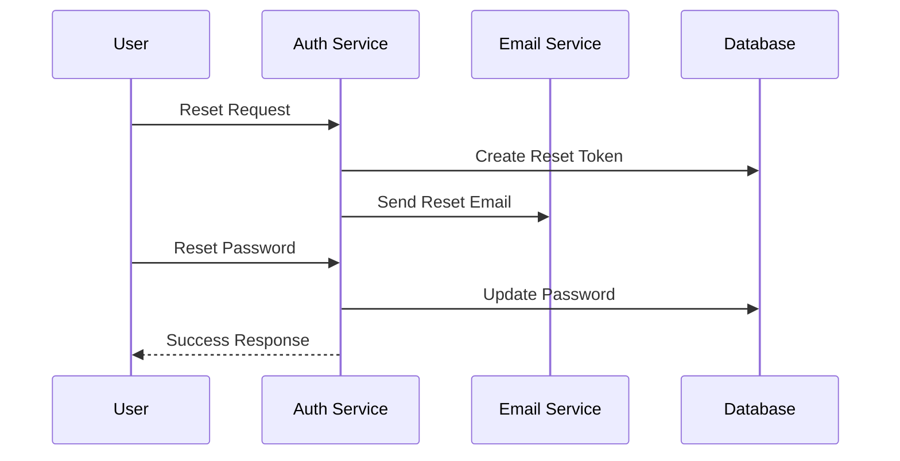
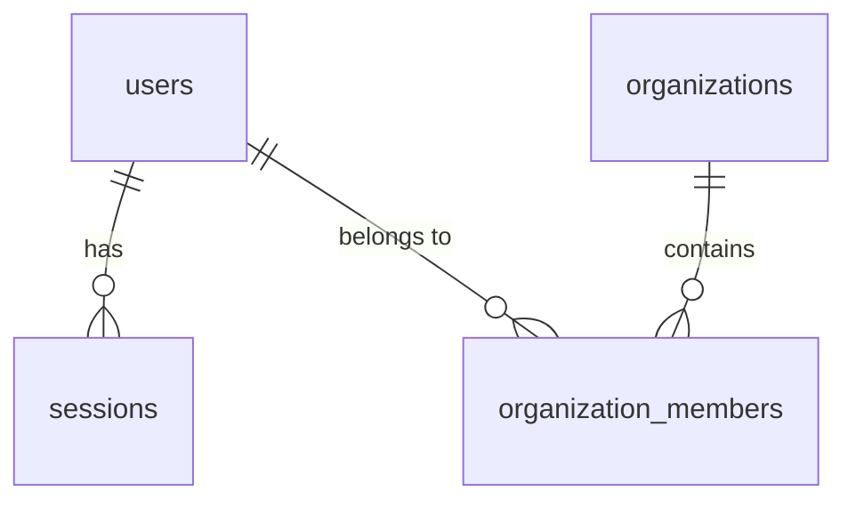
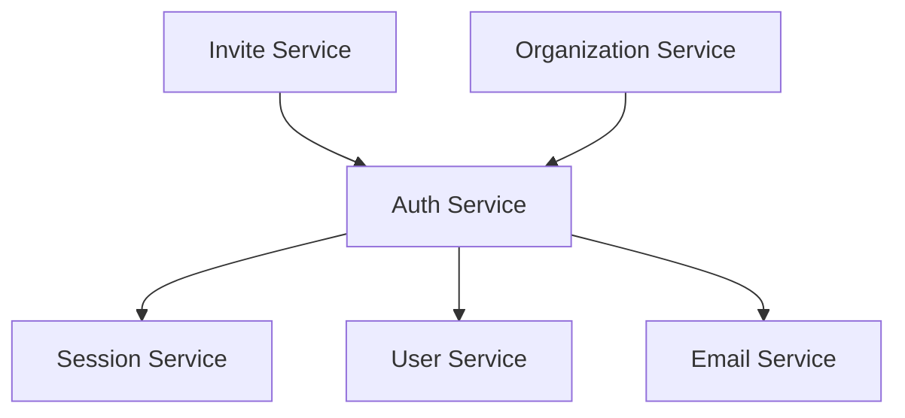

# Authentication Architecture

## Service Design

### Authentication Service

The Authentication service handles all authentication-related operations, including:
- User sign-in
- Sign-up process
- Session management
- Password recovery

We chose to implement this as a separate service for several reasons:

1. **Security Isolation**
   - Separates authentication logic from business logic
   - Centralizes security controls
   - Simplifies security auditing

2. **Centralized Auth Management**
   - Single source of truth for authentication
   - Consistent session handling
   - Unified error management

3. **Flexibility**
   - Supports multiple auth providers
   - Enables custom auth flows
   - Facilitates feature extensions

## Data Structures

### Auth Result

```typescript
interface AuthResult {
  success: boolean;
  session?: Session;
  user?: User;
  error?: string;
  redirectTo?: string;
}
```

This structure supports:
- Operation status
- Session information
- User data
- Error handling
- Redirection

### User Session

```typescript
interface Session {
  id: string;
  user_id: string;
  created_at: string;
  expires_at: string;
  last_active: string;
}
```

Features:
- Session tracking
- Expiration management
- Activity monitoring
- Security controls

## Authentication Flows

### 1. Standard Sign-in Flow



### 2. Invite-based Sign-up Flow



### 3. Password Recovery Flow



## Integration Points

### 1. Invite System Integration

The auth service integrates with invites to:
- Validate invite tokens
- Handle organization sign-ups
- Manage role assignments

### 2. Organization Integration

Connects with organization service for:
- Member creation
- Role validation
- Access control

### 3. Email Integration

Integrates with email service for:
- Password reset
- Email verification
- Security notifications

## Database Schema

### Tables

1. `auth.users`
   - User credentials
   - Profile information
   - Account status

2. `auth.sessions`
   - Session data
   - Activity tracking
   - Security metadata

### Relationships



## Component Architecture



## Security Architecture

### 1. Password Security

```typescript
interface PasswordPolicy {
  minLength: number;
  requireNumbers: boolean;
  requireSpecialChars: boolean;
  requireUppercase: boolean;
  maxAttempts: number;
}
```

### 2. Session Security

```typescript
interface SessionConfig {
  expirationTime: number;
  renewalWindow: number;
  maxConcurrent: number;
  securityLevel: 'high' | 'medium' | 'low';
}
```

### 3. Rate Limiting

```typescript
interface RateLimit {
  window: number;
  maxAttempts: number;
  blockDuration: number;
  ipBased: boolean;
}
```
