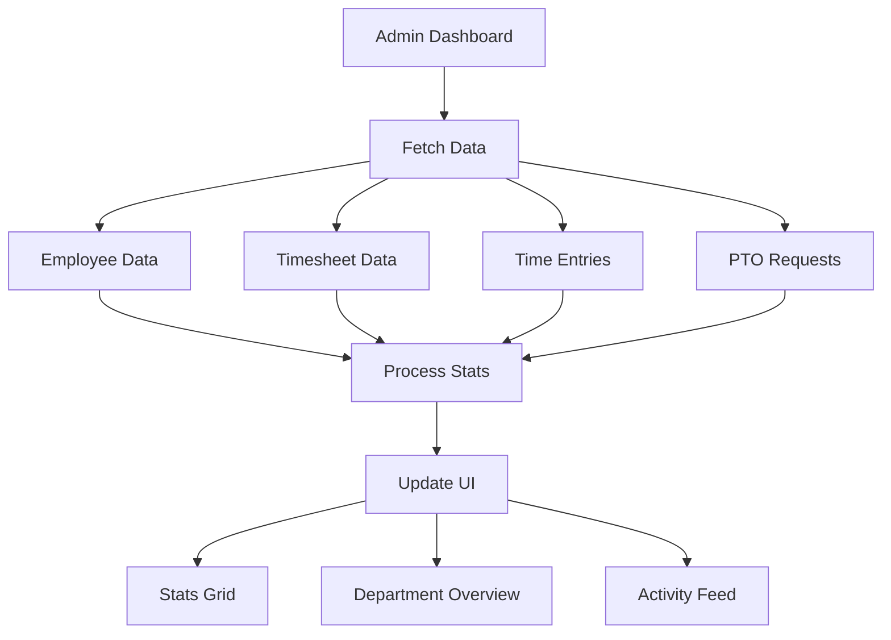
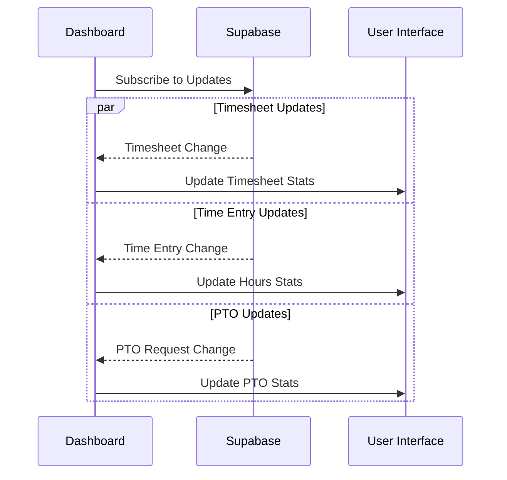
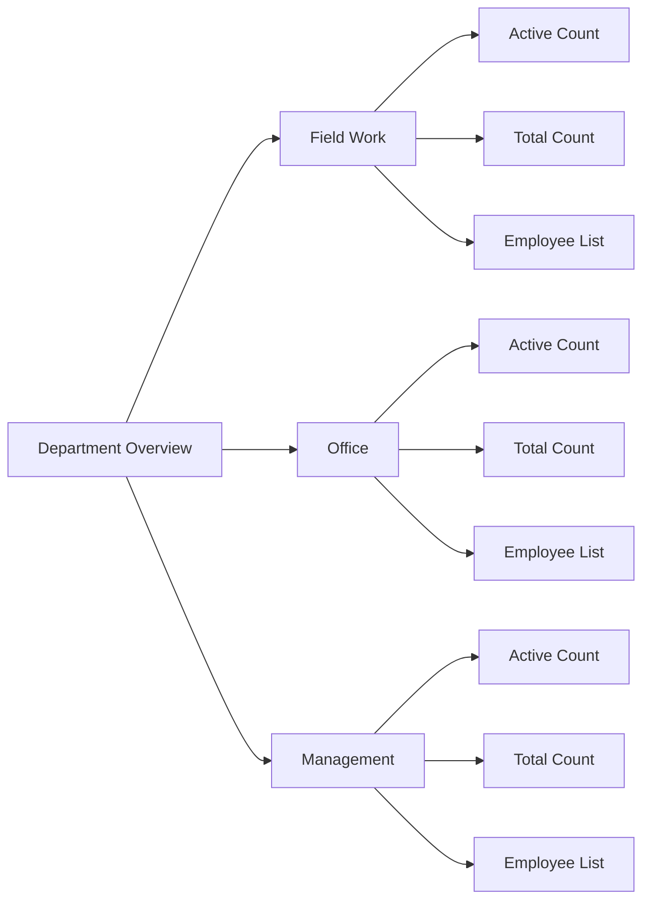

# Admin Dashboard

## Overview
The Admin Dashboard provides organization administrators with a comprehensive overview of employee activities, timesheets, PTO requests, and departmental statistics. It serves as a central hub for monitoring and managing organizational operations.

## Flow Diagrams

### Data Aggregation Flow


### Real-time Update Flow


### Department Overview Structure


## Features

### Statistics Overview
- Active Employees Count
  - Total active employees
  - Breakdown of field workers
  - Click through to Employees page

- Pending Timesheets
  - Count of submitted timesheets awaiting review
  - Quick access to Timesheets page

- Total Hours Today
  - Aggregated work hours across all employees
  - Includes break time calculations
  - Real-time updates

- PTO Requests
  - Count of pending PTO requests
  - Quick access to PTO management page

### Department Overview
- Department-wise employee distribution
- Active vs. total employee counts
- Visual employee representation
  - Individual employee avatars (up to 3 per department)
  - Overflow count for departments with more than 3 employees
- Department statistics and metrics

### Recent Activity Feed
- Real-time activity tracking
- Integration with ActivityFeed component
- Quick access to detailed time entry view

## Implementation Details

### Data Structure

#### Employee Data
```typescript
interface Employee {
  id: string;
  first_name: string;
  last_name: string;
  department: string;
  member_id: string;
  organization_id: string;
  role: string;
}
```

### Loading States
```typescript
const [isLoading, setIsLoading] = useState({
  employees: true,
  timesheets: true,
  timeEntries: true,
  ptoRequests: true
});
```

### Data Integration

#### Employee Data Fetching
```typescript
const { data } = await supabase
  .from('employees')
  .select(`
    id,
    first_name,
    last_name,
    department,
    member_id,
    organization_id,
    organization_members!inner (
      role
    )
  `)
  .eq('organization_id', organization.id);
```

#### Time Entry Calculations
```typescript
const totalHoursToday = timeEntries
  .filter(entry => entry.clock_out)
  .reduce((acc, entry) => {
    const start = new Date(entry.clock_in);
    const end = new Date(entry.clock_out!);
    const breakMinutes = entry.total_break_minutes || 0;
    return acc + ((end.getTime() - start.getTime()) / (1000 * 60 * 60)) - (breakMinutes / 60);
  }, 0);
```

## Component Structure

### Stats Grid
- Four key metric cards
- Interactive navigation to detailed views
- Real-time updates

### Department Panel
- Department cards with employee summaries
- Visual employee representation
- Active/total employee counts

### Activity Feed Panel
- Recent activities list
- Link to detailed time entry view
- Real-time updates

## Technical Considerations

### State Management
- Organization context for global data
- Local state for UI components
- Loading and error states

### API Integration
- Supabase queries for employee data
- Service integration for:
  - Timesheet management
  - Time entry tracking
  - PTO request handling

### Error Handling
- Comprehensive error states
- Retry functionality
- User-friendly error messages

### Real-time Updates
- Supabase subscriptions for:
  - Time entries
  - Timesheet status changes
  - PTO request updates

## Security
- Role-based access control
- Organization-scoped queries
- Admin-only access restrictions

## Performance Optimization
- Efficient data fetching
- Optimized calculations
- Proper loading states
- Cached department calculations

## Future Enhancements
1. Advanced filtering options
2. Custom department views
3. Export functionality
4. Enhanced analytics
5. Custom metric tracking