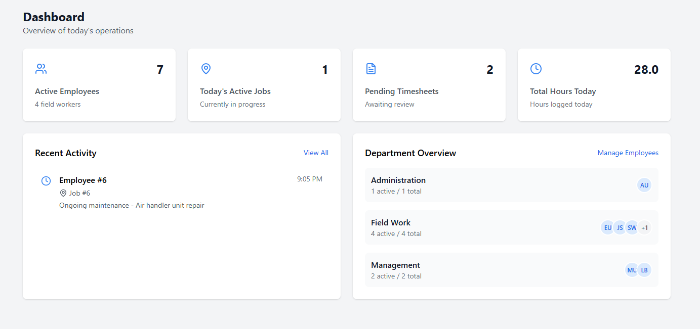
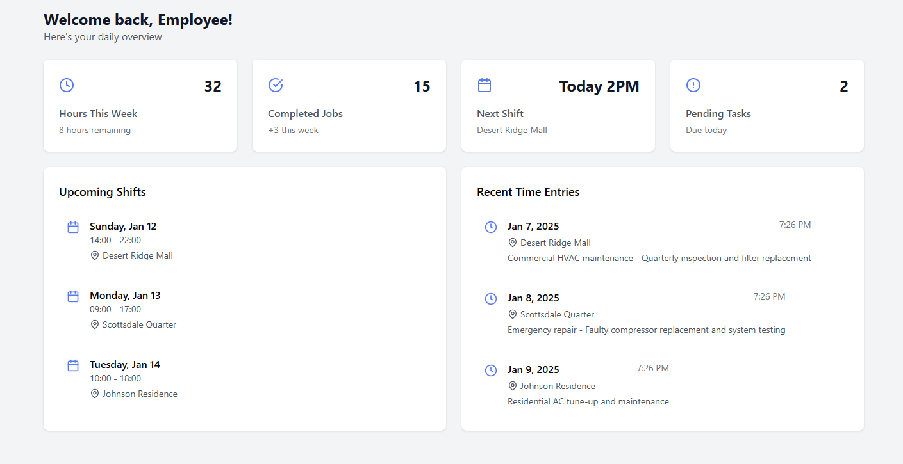
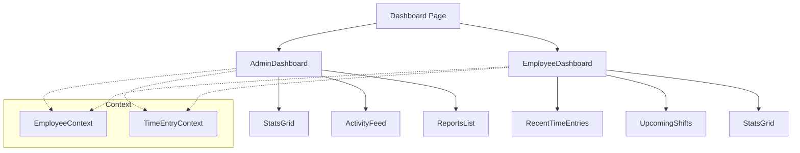
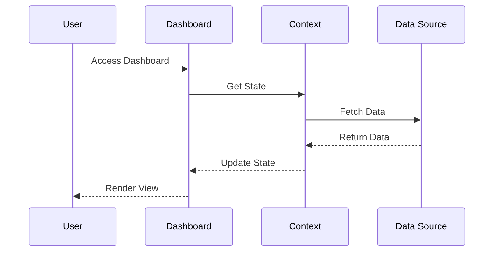

# Dashboard Feature Technical Documentation

## Tech Stack & Dependencies

### Core Technologies
- **React**: Frontend library for building user interfaces
- **TypeScript**: Static typing and enhanced developer experience
- **TailwindCSS**: Utility-first CSS framework

### Key Libraries
- **date-fns**: Date manipulation and formatting
- **lucide-react**: Icon components

### Screenshot

#### Admin Dashboard

#### Employee Dashboard

## Architecture Overview
The Dashboard feature provides role-specific views (Admin/Employee) with real-time data visualization and quick access to key functionalities.

### Component Architecture

### Data Flow

## Core Components

### AdminDashboard
- Overview of company-wide metrics
- Access to reports and analytics
- Activity monitoring
- Key performance indicators

### EmployeeDashboard
- Personal time tracking overview
- Upcoming shift information
- Recent activity summary
- Quick access to common actions

### Supporting Components

#### StatsGrid
- Display key metrics in grid layout
- Real-time data updates
- Responsive design
- Configurable metrics based on role

#### ActivityFeed
- Real-time activity updates
- Filterable feed items
- Timestamp tracking
- Interactive elements

#### ReportsList
- Quick access to reports
- Report status indicators
- Filtering capabilities
- Export options

#### RecentTimeEntries
- Latest time entries display
- Quick edit functionality
- Status indicators
- Validation feedback

#### UpcomingShifts
- Future shift schedule
- Location information
- Shift duration
- Assignment details

## State Management
- Uses React Context for global state
- Local state for component-specific data
- Real-time updates through context providers
- Optimistic UI updates

## Code Organization
- Components: `/src/components/dashboard/`
  - Role-specific dashboards
  - Reusable widgets
  - Data visualization components
- Utilities: `/src/utils/`
  - Date formatting
  - Data calculations
  - Helper functions

## Best Practices

### Performance
- Component memoization
- Lazy loading of widgets
- Data caching
- Optimized re-renders

### Data Handling
- Type-safe data structures
- Error boundary implementation
- Loading state management
- Data validation

### UI/UX Guidelines
- Consistent grid layout
- Responsive design
- Clear data visualization
- Interactive elements
- Loading indicators
- Error states

### Security
- Role-based access control
- Data validation
- Input sanitization
- Session management

## Integration Points
- Time Entry system
- Reports system
- Employee management
- PTO tracking
- Job location management

## Future Enhancements
- Customizable dashboard layouts
- Additional widgets
- Advanced analytics
- Real-time notifications
- Mobile optimization
- Data export capabilities
