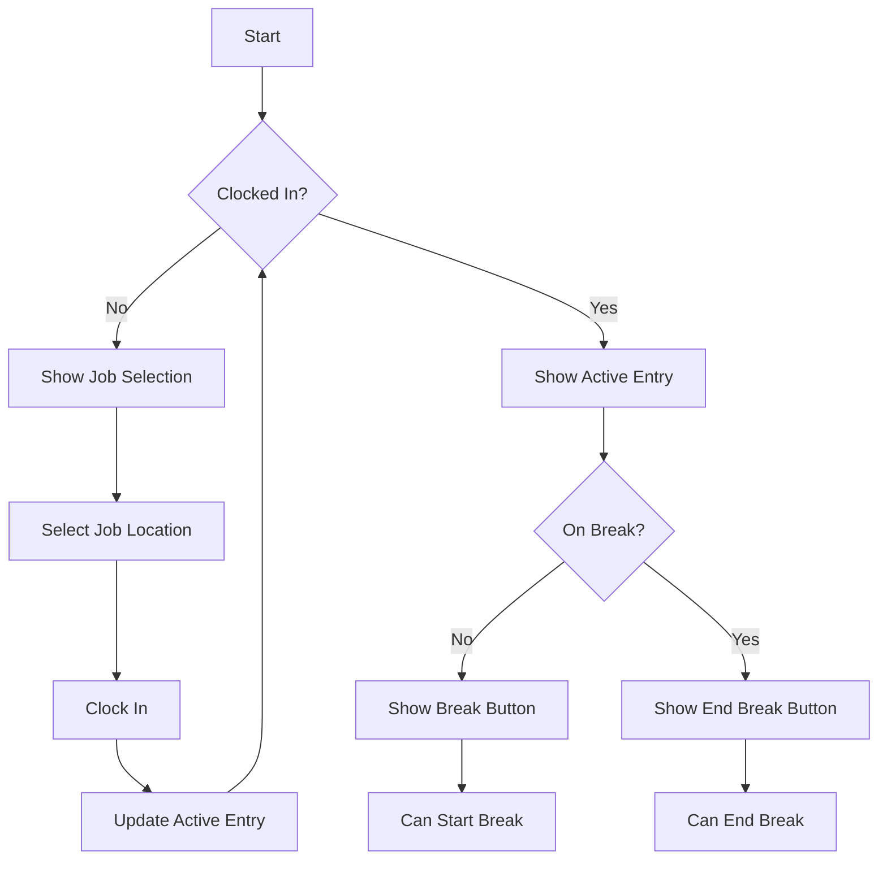
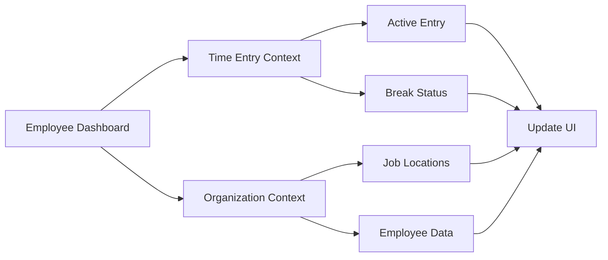
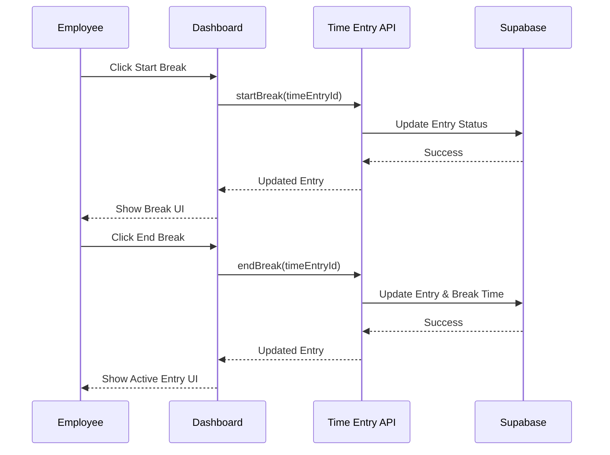

# Employee Dashboard

## Overview
The Employee Dashboard provides employees with a centralized view of their work activities, time tracking, and job locations. It enables quick access to time entry functions and displays real-time work status.

## Flow Diagrams

### Time Entry Flow


### Data Integration Flow


### Break Management Flow


## Features

### Current Status Display
- Shows whether employee is:
  - Not clocked in
  - Working
  - On break
- Displays clock-in time for active sessions
- Links to Time Entry page for detailed view

### Job Location Selection
- List of available job locations
- Quick clock-in functionality
- Service type handling for locations with multiple services

### Break Management
- Start break button during active work sessions
- End break button during break periods
- Break duration tracking
- Break time included in total hours calculation

### Today's Work History
- Chronological list of completed and ongoing time entries
- Location name and time duration for each entry
- Work description display
- Status indicators (Completed/In Progress)

### Statistics
- Current work status with start time
- Total completed entries for the day

## Implementation Details

### Loading States
```typescript
const [isLoading, setIsLoading] = useState({
  locations: true,
  timeEntries: true,
  employee: true
});
```

### Error Handling
- Comprehensive error states for:
  - Failed API requests
  - Data loading issues
  - Clock in/out operations
- Retry functionality for failed operations

### Data Integration
- Real-time synchronization with Supabase
- Integration with job location service
- Time entry management
- Employee data fetching

### Component Structure
```typescript
// Main sections
1. Welcome header with employee name
2. Stats grid showing key metrics
3. Current activity panel
   - Clock in form (when inactive)
   - Active session display (when working)
   - Break controls
4. Work history panel
```

## User Experience

### Clock In Flow
1. Select job location from dropdown
2. Clock in button appears
3. Click to start time entry
4. Active session display updates

### Break Management
1. Start break during active session
2. Break timer begins
3. End break to resume work
4. Break time tracked in total hours

### Work History
- Real-time updates as entries complete
- Clear status indicators
- Chronological organization
- Location and time information

## Technical Considerations

### State Management
- Uses TimeEntry context for active sessions
- Local state for UI components
- Loading states for async operations

### API Integration
```typescript
// Fetch employee data
const result = await getEmployeeByUserId(user.id, organization.id);

// Fetch job locations
const result = await listLocations(organization.id);

// Fetch time entries
const result = await listTimeEntries(organization.id, {
  employeeId: user.id,
  startDate: today,
  endDate: tomorrow
});
```

### Real-time Updates
- Supabase subscriptions for time entries
- Immediate UI updates on status changes
- Optimistic updates for better UX

## Security
- Role-based access control
- Organization-scoped queries
- User authentication checks