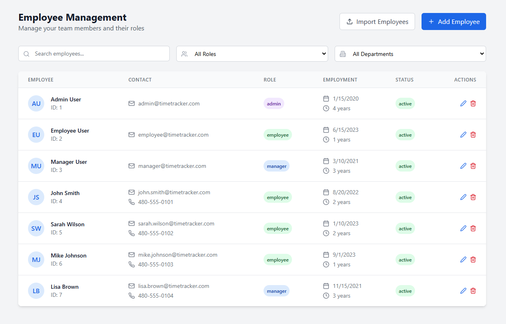
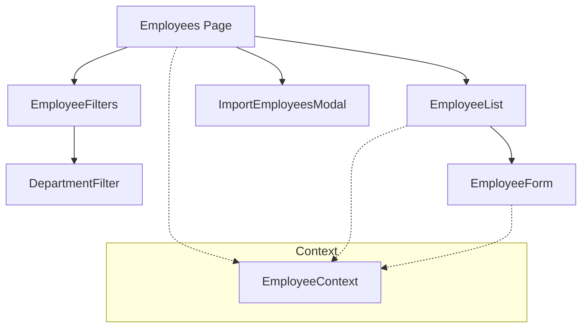
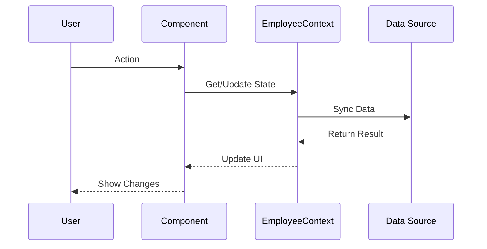

# Employees Feature Technical Documentation

## Tech Stack & Dependencies

### Core Technologies
- **React**: Frontend library for building user interfaces
- **TypeScript**: Static typing and enhanced developer experience
- **TailwindCSS**: Utility-first CSS framework

### Key Libraries
- **date-fns**: Date manipulation and formatting
- **lucide-react**: Icon components

### Screenshot



## Architecture Overview
The Employees feature provides comprehensive employee management capabilities including employee data management, filtering, and bulk import functionality.

### Component Architecture


### Data Flow


## Core Components

### EmployeeList
- Display employee data in table format
- Sortable columns
- Pagination
- Row selection
- Quick actions
- Status indicators

### EmployeeForm
- Add/Edit employee information
- Form validation
- Role assignment
- Department selection
- Contact information
- Employment details
- Error handling

### EmployeeFilters
- Filter by multiple criteria
- Search functionality
- Department filtering
- Role filtering
- Status filtering
- Clear filters option

### DepartmentFilter
- Department selection
- Multi-select capability
- Department hierarchy
- Quick selection options

### ImportEmployeesModal
- Bulk employee import
- File upload
- Data validation
- Error reporting
- Success confirmation
- Template download

## State Management
- Uses EmployeeContext for global state
- Local state for form handling
- Optimistic updates
- Error state management
- Loading state tracking

## Code Organization
- Components: `/src/components/employees/`
  - List and table components
  - Form components
  - Filter components
  - Import functionality
- Utilities: `/src/utils/`
  - Data validation
  - Format conversion
  - Helper functions

## Data Structure
```typescript
interface Employee {
  id: string;
  firstName: string;
  lastName: string;
  email: string;
  department: string;
  role: string;
  startDate: string;
  status: 'active' | 'inactive';
  contactInfo: {
    phone: string;
    address: string;
  };
  employmentDetails: {
    type: 'full-time' | 'part-time' | 'contractor';
    position: string;
    supervisor: string;
  };
}
```

## Best Practices

### Performance
- Pagination for large lists
- Debounced search
- Memoized components
- Optimized re-renders
- Lazy loading modals

### Data Handling
- Type-safe operations
- Data validation
- Error boundaries
- Loading states
- Optimistic updates

### UI/UX Guidelines
- Consistent table layout
- Clear form structure
- Responsive design
- Loading indicators
- Error messages
- Success feedback
- Confirmation dialogs

### Security
- Role-based access control
- Input sanitization
- Data validation
- Session management
- Audit logging

## Integration Points
- Time Entry system
- PTO management
- Reports system
- Job location assignment
- Payroll system (future)

## Import/Export Features
- CSV file import
- Template generation
- Data validation rules
- Error reporting
- Success confirmation
- Progress tracking

## Future Enhancements
- Advanced search capabilities
- Bulk operations
- Organization chart
- Employee self-service
- Document management
- Performance tracking
- Training records
- Certification management

## Error Handling
- Form validation errors
- API error handling
- Import validation errors
- Network error handling
- Retry mechanisms
- User feedback

## Testing Considerations
- Component unit tests
- Form validation tests
- Import/Export tests
- Filter logic tests
- Integration tests
- Error handling tests
