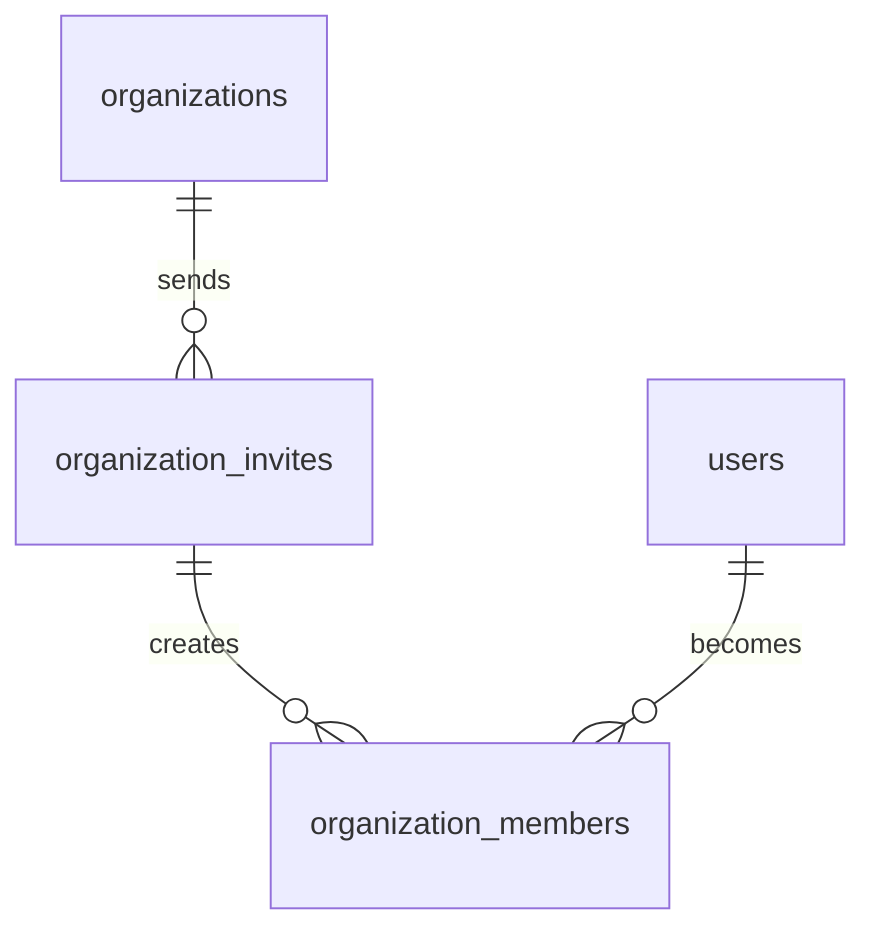
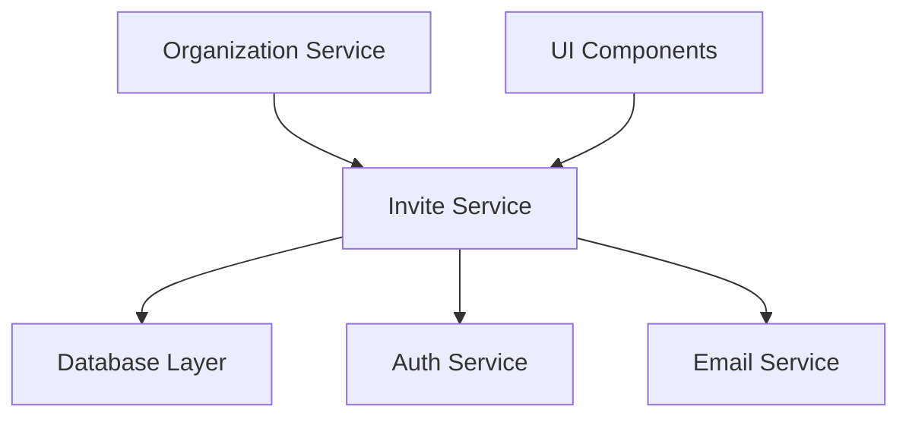
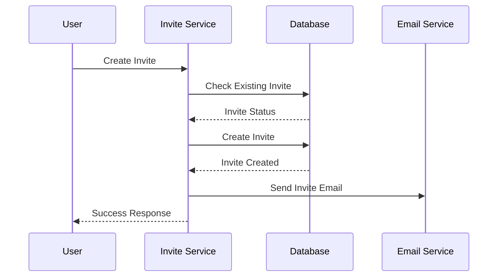
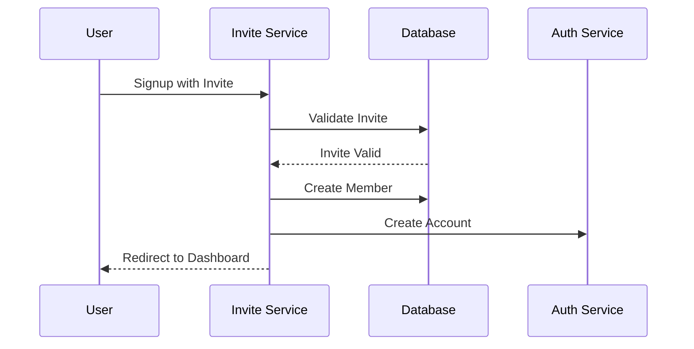

# Invite Service Architecture

## Service Design

### Invite Service

The Invite Service (`src/services/invites.ts`) is the core component that handles all invitation-related operations. We chose to implement this as a separate service for several reasons:

1. **Separation of Concerns**
   - Isolates invitation logic from organization management
   - Makes the codebase more maintainable and testable
   - Allows for future extensions without affecting other components

2. **Centralized Invite Management**
   - Single source of truth for invitations
   - Consistent handling of invite operations
   - Unified error handling and validation

3. **Reusability**
   - Can be used across different organization flows
   - Facilitates integration with signup process
   - Enables consistent invite handling

## Data Structures

### Invite Result

```typescript
interface InviteResult {
  success: boolean;
  inviteId?: string;
  redirectTo?: string;
  error?: string;
}
```

This structure supports:
- Operation success/failure status
- Invite identification
- Redirection handling
- Error messaging

### Organization Invite

```typescript
interface OrganizationInvite {
  id: string;
  email: string;
  organization_id: string;
  role: string;
  created_at: string;
  updated_at: string;
}
```

Features:
- Email-based invitations
- Role assignment
- Organization association
- Timestamp tracking

## Integration Points

### 1. Authentication Integration

The Invite Service integrates with authentication to:
- Validate user signup
- Handle invite-based registrations
- Manage user roles

### 2. Organization Management Integration

Connects with organization management for:
- Member creation
- Role assignment
- Organization validation

### 3. Email Service Integration

Integrates with email service to:
- Send invite notifications
- Handle invite reminders
- Track invite status

## Database Schema

### Tables

1. `organization_invites`
   - Primary invite data
   - Email and role information
   - Organization relationship

2. `organization_members`
   - Member relationships
   - Role assignments
   - User-organization mapping

### Relationships



## Component Architecture



## Flow Control

### Invite Creation Flow



### Signup Flow


