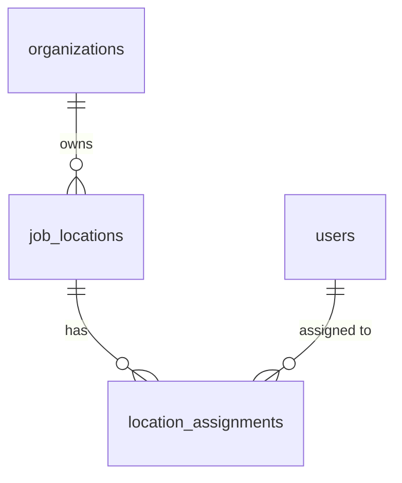
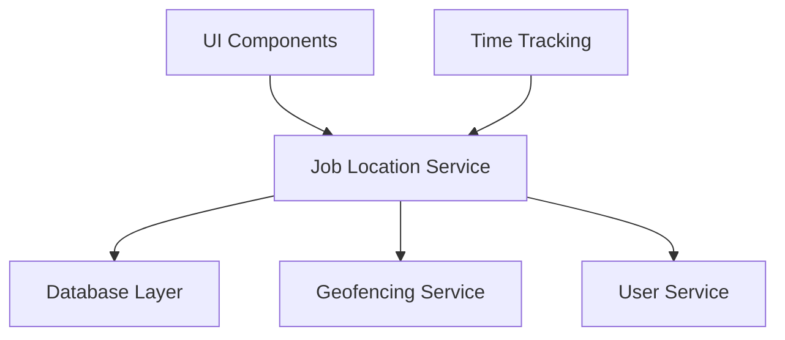

# Job Locations Architecture

## Service Design

### Job Location Service

The Job Location service (`src/services/jobLocations.ts`) is the core component that handles all location-related operations. We chose to implement this as a separate service for several reasons:

1. **Separation of Concerns**
   - Isolates location management logic from UI components
   - Makes the codebase more maintainable and testable
   - Allows for future extensions without affecting the UI

2. **Centralized Location Management**
   - Single source of truth for location data
   - Consistent handling of location operations
   - Unified error handling and validation

3. **Reusability**
   - Can be used by multiple components
   - Facilitates integration with other features
   - Enables consistent location handling across the application

## Data Structures

### Location

```typescript
interface Location {
  id: string;
  name: string;
  address: string;
  latitude: number;
  longitude: number;
  radius: number;
  organization_id: string;
  is_active: boolean;
  created_at: string;
  updated_at: string;
}
```

This structure supports:
- Basic location information (name, address)
- Geofencing capabilities (latitude, longitude, radius)
- Organization management (organization_id)
- Soft deletion (is_active)
- Audit trail (created_at, updated_at)

### Location Assignment

```typescript
interface LocationAssignment {
  id: string;
  user_id: string;
  location_id: string;
  start_date: string;
  end_date?: string;
  is_primary: boolean;
}
```

Features:
- Multiple location assignments per user
- Primary location designation
- Assignment date tracking
- Historical assignment records

## Integration Points

### 1. Time Tracking Integration

The Job Location service integrates with time tracking to:
- Validate clock-in/out locations
- Enforce location-based work policies
- Track remote vs. on-site work

### 2. User Management Integration

Connects with user management for:
- Location assignments
- Access control
- User-location relationship management

### 3. Organization Management Integration

Integrates with organization management to:
- Filter locations by organization
- Manage location access permissions
- Handle organization-specific settings

## Database Schema

### Tables

1. `job_locations`
   - Primary location data
   - Geofencing information
   - Organization relationship

2. `location_assignments`
   - User-location relationships
   - Assignment history
   - Primary location flags

### Relationships



## Component Architecture


