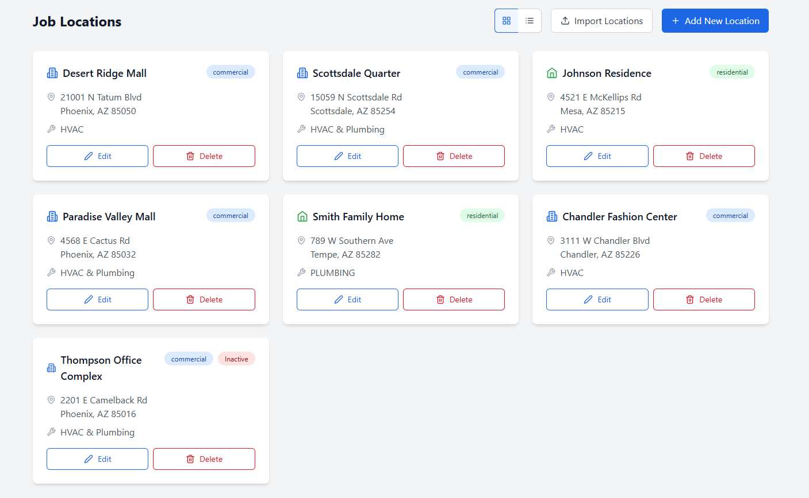
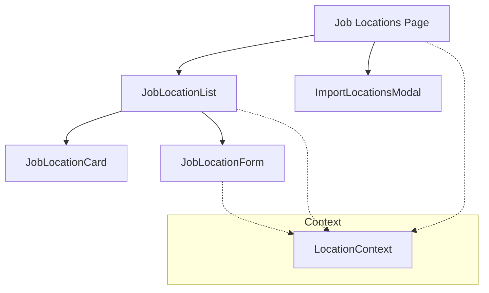
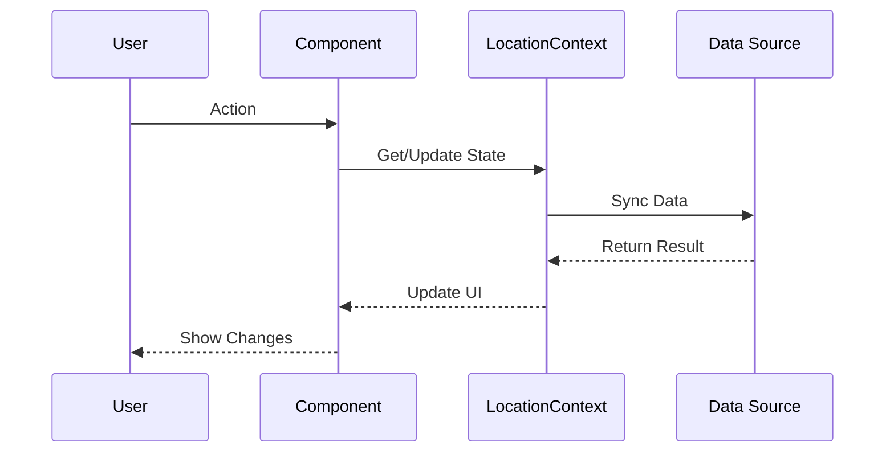

# Job Locations Feature Technical Documentation

## Tech Stack & Dependencies

### Core Technologies
- **React**: Frontend library for building user interfaces
- **TypeScript**: Static typing and enhanced developer experience
- **TailwindCSS**: Utility-first CSS framework

### Key Libraries
- **date-fns**: Date manipulation and formatting
- **lucide-react**: Icon components

## Screenshot

### Admin Job Locations


## Architecture Overview
The Job Locations feature manages work site information, including location details, assignments, and bulk import capabilities.

### Component Architecture


### Data Flow


## Core Components

### JobLocationList
- Grid/List view of locations
- Sorting capabilities
- Search functionality
- Filter options
- Status indicators
- Quick actions

### JobLocationCard
- Location details display
- Interactive elements
- Status indicators
- Quick actions
- Assignment information
- Contact details

### JobLocationForm
- Add/Edit location information
- Form validation
- Address validation
- Contact information
- Operating hours
- Assignment management
- Error handling

### ImportLocationsModal
- Bulk location import
- File upload
- Data validation
- Error reporting
- Success confirmation
- Template download

## State Management
- Uses LocationContext for global state
- Local state for form handling
- Optimistic updates
- Error state management
- Loading state tracking

## Code Organization
- Components: `/src/components/job-locations/`
  - List and grid components
  - Form components
  - Card components
  - Import functionality
- Utilities: `/src/utils/`
  - Address validation
  - Format conversion
  - Helper functions

## Data Structure
```typescript
interface JobLocation {
  id: string;
  name: string;
  address: {
    street: string;
    city: string;
    state: string;
    zipCode: string;
    country: string;
  };
  contactInfo: {
    phone: string;
    email: string;
    primaryContact: string;
  };
  operatingHours: {
    monday: { start: string; end: string };
    tuesday: { start: string; end: string };
    wednesday: { start: string; end: string };
    thursday: { start: string; end: string };
    friday: { start: string; end: string };
    saturday: { start: string; end: string };
    sunday: { start: string; end: string };
  };
  status: 'active' | 'inactive';
  assignedEmployees: string[];
  notes: string;
}
```

## Best Practices

### Performance
- Lazy loading of location details
- Optimized image loading
- Memoized components
- Efficient list rendering
- Cached location data

### Data Handling
- Type-safe operations
- Address validation
- Error boundaries
- Loading states
- Optimistic updates

### UI/UX Guidelines
- Consistent card layout
- Clear form structure
- Responsive design
- Loading indicators
- Error messages
- Success feedback
- Confirmation dialogs
- Map integration

### Security
- Role-based access control
- Input sanitization
- Data validation
- Session management
- Audit logging

## Integration Points
- Employee management system
- Time Entry system
- Reports system
- Maps service
- Scheduling system

## Import/Export Features
- CSV file import
- Template generation
- Data validation rules
- Error reporting
- Success confirmation
- Progress tracking

## Future Enhancements
- Advanced search capabilities
- Map view integration
- Route optimization
- Capacity planning
- Resource allocation
- Mobile app integration
- QR code generation
- Check-in system

## Error Handling
- Form validation errors
- API error handling
- Import validation errors
- Network error handling
- Retry mechanisms
- User feedback

## Testing Considerations
- Component unit tests
- Form validation tests
- Import/Export tests
- Address validation tests
- Integration tests
- Error handling tests
