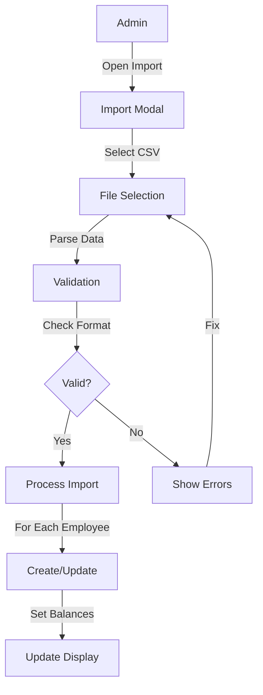
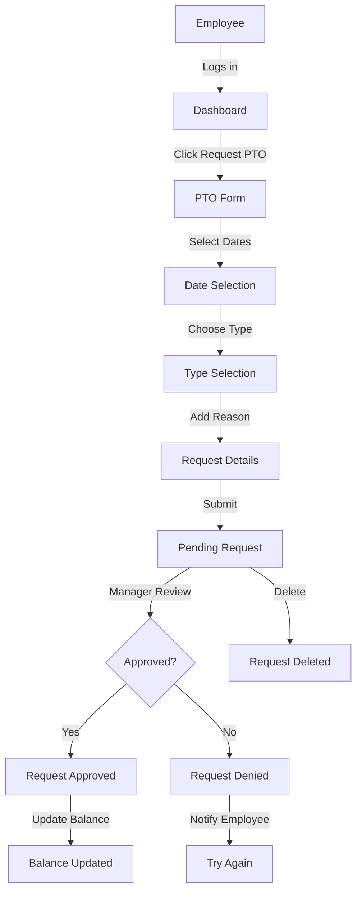
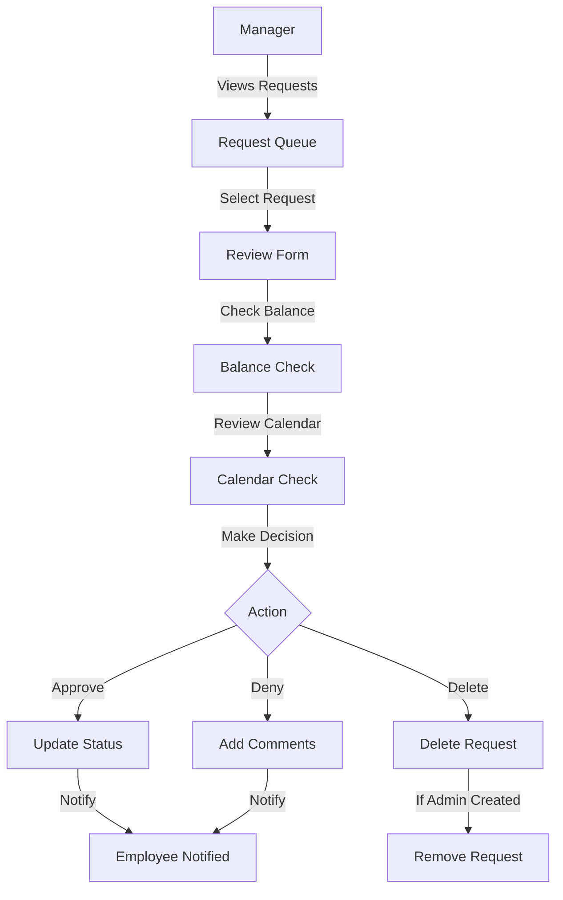
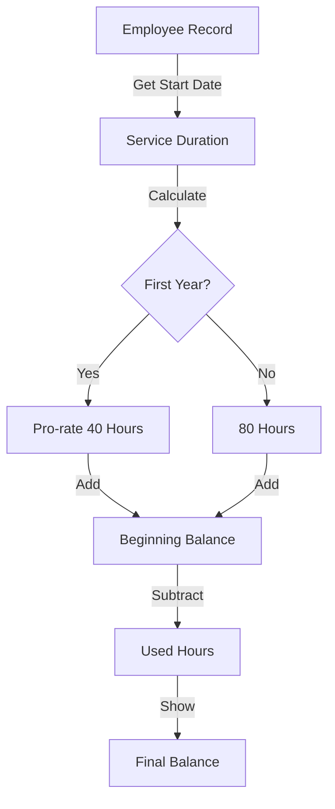
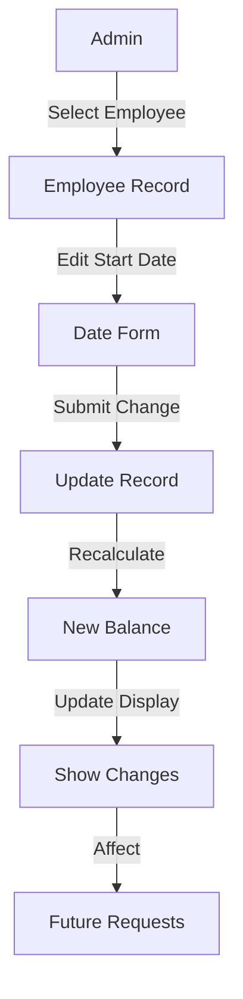

# PTO Feature Overview

## What is the PTO Feature?
The PTO (Paid Time Off) feature helps manage employee time off, including both vacation time and sick leave. It provides an easy way for employees to request time off and for managers to review and manage these requests.

## Key Features

### For Employees
1. **View PTO Balances**
   - See available vacation hours
   - Track sick leave balance
   - View upcoming time off
   - See beginning balances for transfers

2. **Request Time Off**
   - Select dates
   - Choose type (vacation or sick leave)
   - Provide reason
   - See status of requests with tracking info
   - View request history with timestamps
   - Edit pending requests
   - Delete pending requests

### For Managers/Admins
1. **Manage Requests**
   - Review employee requests with creator info
   - Approve or deny with comments and timestamps
   - View team calendar
   - Track request review history
   - Delete admin-created requests
   - Create PTO requests on behalf of any employee (including admins and managers)

2. **Track Balances**
   - Monitor team PTO usage
   - View individual balances with beginning balances
   - Import employee PTO data
   - Manage employment dates
   - View and manage PTO for all employee types (regular employees, managers, and admins)

## How PTO is Calculated

### Vacation Time
- First year: Pro-rated 40 hours (5 days)
  - Example: 6 months worked = 20 hours allocation
- Second year onwards: 80 hours (10 days)
- Total Balance = Beginning Balance + Accrued Hours - Used Hours
- Beginning balance can be imported for transfers
- Tracks used hours across pending and approved requests
- Ensures balances never go negative

### Sick Leave
- Accrual rate: 1 hour per 40 hours worked
- Total Balance = Beginning Balance + Accrued Hours - Used Hours
- Beginning balance can be imported for transfers
- Based on actual worked hours from timesheets
- Tracks used hours across pending and approved requests
- Ensures balances never go negative

## Common Workflows

### Importing Employee PTO Data


### Requesting Time Off


### Reviewing Requests (Managers)


### Balance Calculation


### Employment Date Update


## Business Rules

### Import Rules
- CSV format must match template
- All balances must be non-negative
- Start date required for calculations
- Email and names are required
- Role must be valid (admin/manager/employee)

### Balance Rules
- Vacation time pro-rated in first year
- Sick leave based on worked hours (1:40 ratio)
- Beginning balances respected for transfers
- Pending requests counted against balance
- Balance updates immediately upon approval

## Import Template Format
```csv
first_name,last_name,email,phone,role,department,start_date,sick_leave_beginning_balance,vacation_beginning_balance
```

Example:
```csv
John,Doe,john@example.com,123-456-7890,employee,Sales,2024-01-15,0,0
Jane,Smith,jane@example.com,123-456-7891,manager,Engineering,2023-12-01,24,8
```

## Reports and Views

### Employee View
- Current balances with beginning balance
- Request history
- Pending requests
- Upcoming time off

### Manager View
- Team calendar
- Balance summary with beginning balances
- Request queue
- Import/Export capabilities

## Recent Updates (v1.3.0)

### New Features
- Employee PTO data import with beginning balances
- Pro-rated first year vacation calculation
- Improved balance calculations
- Better date handling and validation
- Loading states for async operations

### Coming Soon
- Holiday calendar integration
- Balance carryover rules
- Mobile app support
- Team calendar view
- Enhanced reporting

## Support
For technical issues or questions about using the PTO feature, please contact your system administrator or the IT support team.
