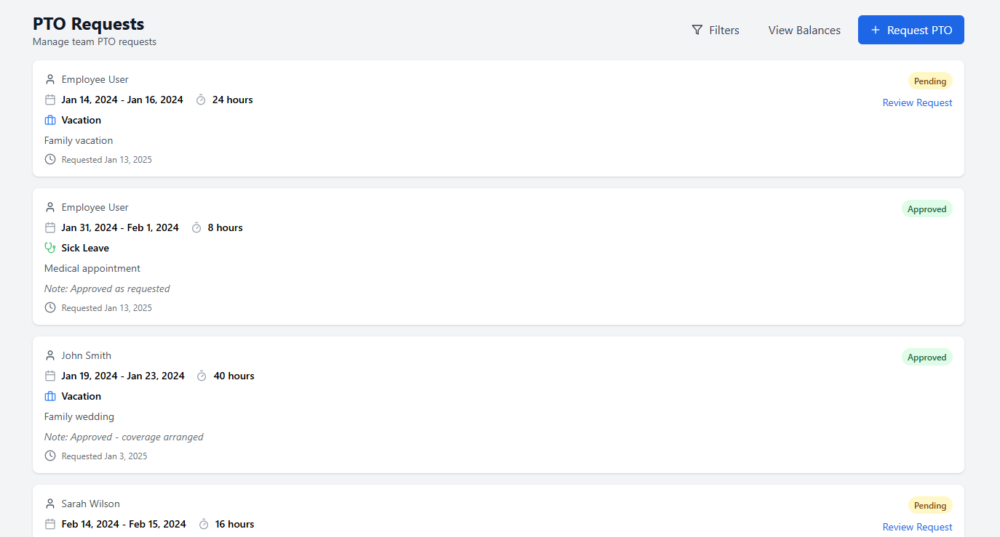
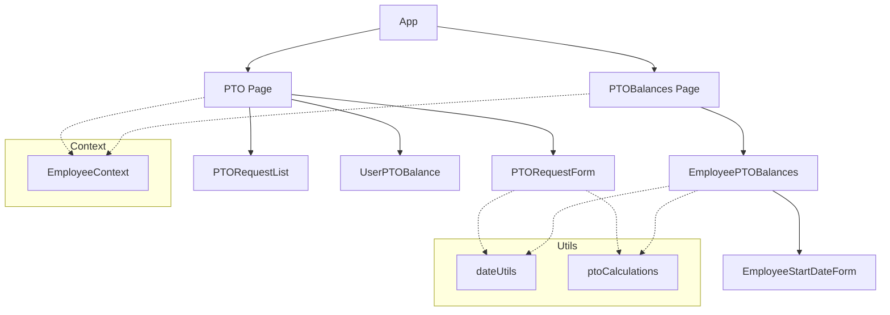
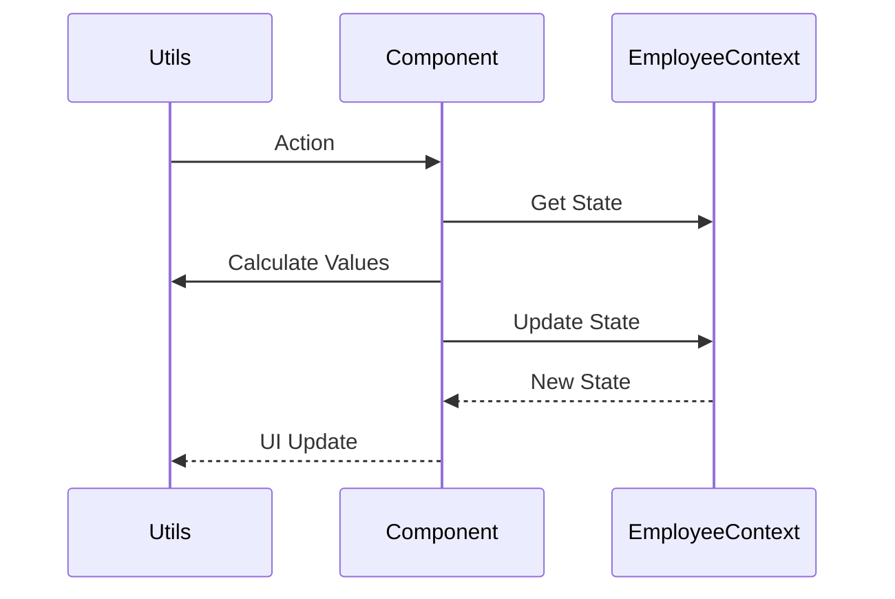
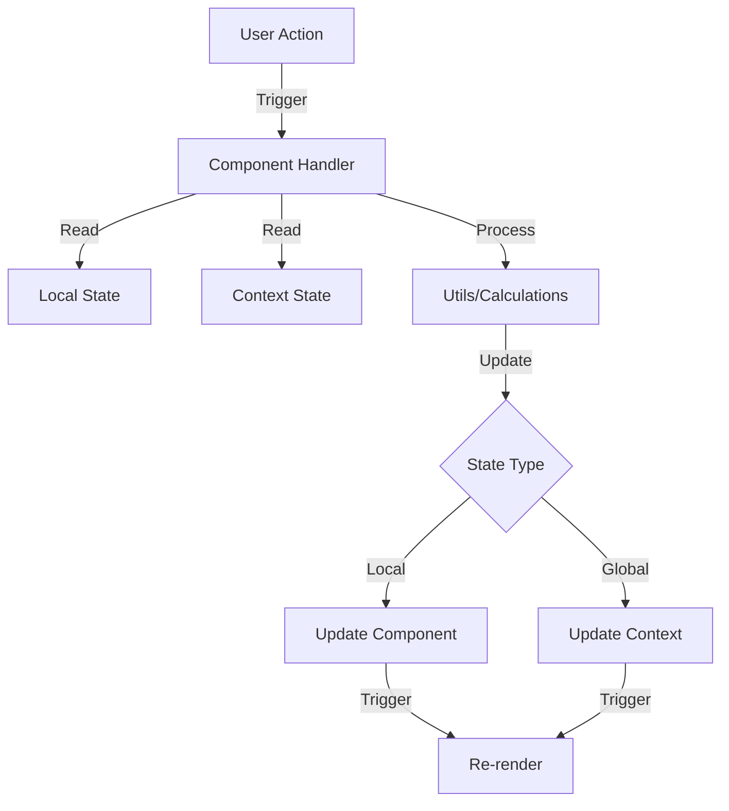

# PTO Feature Technical Documentation

## Tech Stack & Dependencies

### Core Technologies
- **React**: Frontend library for building user interfaces
- **TypeScript**: Static typing and enhanced developer experience
- **Vite**: Build tool and development server
- **ES Modules**: Using native JavaScript modules (import/export)

### Key Libraries
- **date-fns**: Date manipulation and formatting
- **lucide-react**: Icon components
- **tailwindcss**: Utility-first CSS framework

### Module System
- Using ES Modules (import/export) syntax
- No CommonJS (require/module.exports) usage
- All imports must be at the top level of files
- Dynamic imports should use the import() function, not require()

### Development Environment
- VSCode as primary IDE
- ESLint for code linting
- Prettier for code formatting
- TypeScript compiler for type checking

### Screenshot

### PTO Request

## Architecture Overview
The PTO feature is built using React with TypeScript, utilizing context for global state management and modular components for different functionalities.

### Component Architecture

### Data Flow

### State Management

## Core Components

### Pages

#### 1. PTO Page (`/src/pages/PTO.tsx`)
- Main PTO management interface
- Features:
  - PTO request creation/editing
  - Request list viewing
  - Request filtering
  - Balance viewing
- Key States:
  - `requests`: List of PTO requests
  - `filters`: Current filter settings
  - `selectedRequest`: Currently selected request for review
  - `editingRequest`: Request being edited

[Rest of the technical documentation from pto-feature.md...]

## Implementation Notes

### State Management Strategy
- EmployeeContext for global employee data
- Local state for form handling
- Props for component-specific data

### Data Flow
1. User actions trigger component handlers
2. Handlers update local state or context
3. Context updates trigger re-renders
4. Components reflect updated state

### Code Organization
- Components grouped by feature
- Utilities separated by function
- Types centralized in types.ts
- Constants in separate files

### Testing Considerations
- Component isolation
- Context mocking
- Date handling edge cases
- Balance calculation accuracy

## API Integration Points
(For future implementation)
- Employee data sync
- Timesheet integration
- Notification system
- Calendar service

## Performance Considerations
- Memoization of calculations
- Lazy loading of components
- Optimistic updates
- Batch processing

## Integration with Reports
PTO data is displayed in various reports, particularly the Employee Hours Report. For detailed documentation about reports implementation and features, see [Reports Feature Technical Documentation](./reports-feature-technical.md).

## Timesheet Features

### Time Entry Management
- Clock in/out time editing for non-approved timesheets
- Automatic hours calculation using date-fns
- Individual entry hours display
- Total timesheet hours calculation and display
- Real-time hours updates on time changes

### Validation Rules
- Clock out time must be after clock in time
- All entries must have clock out times before submission
- Time validation on both individual edits and submission
- Prevents invalid time entries from being saved

### Status Management
- Read-only mode for approved timesheets
- Visual indicators for timesheet status
- Clear feedback for validation errors
- Automatic recalculation of hours on changes

## Security Notes
- Role-based access control
- Data validation
- Input sanitization
- Session management

## Code Standards & Best Practices

### Module Imports
- Always use ES Module syntax (import/export)
- Place all imports at the top level of the file
- Group imports in the following order:
  1. React and core libraries
  2. Third-party libraries
  3. Project utilities and types
  4. Components
  5. Assets and styles

### Mock Data Handling
- Import mock data using ES Module syntax
- Mock data should be imported at the top level
- Future implementation will replace mock data with API calls
- Mock data files location: src/lib/mock*.ts

### Component Structure
- Use TypeScript interfaces for props
- Implement proper type checking
- Keep components focused and modular
- Use hooks for shared logic
- Follow React best practices for state management

### Error Handling
- Implement proper error boundaries
- Use TypeScript to prevent type-related errors
- Handle edge cases gracefully
- Provide meaningful error messages

### Time Validation
- Validate time entries immediately on input
- Ensure clock out time is after clock in time
- Validate all entries before timesheet submission
- Use date-fns for consistent time calculations
- Round time calculations to 2 decimal places
- Handle timezone considerations properly
