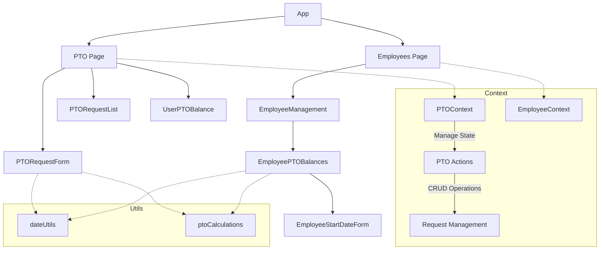
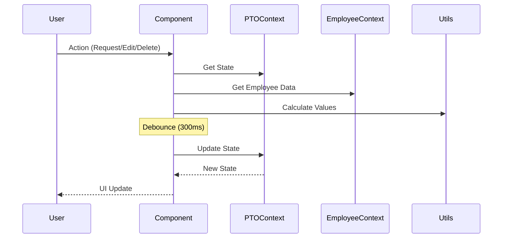
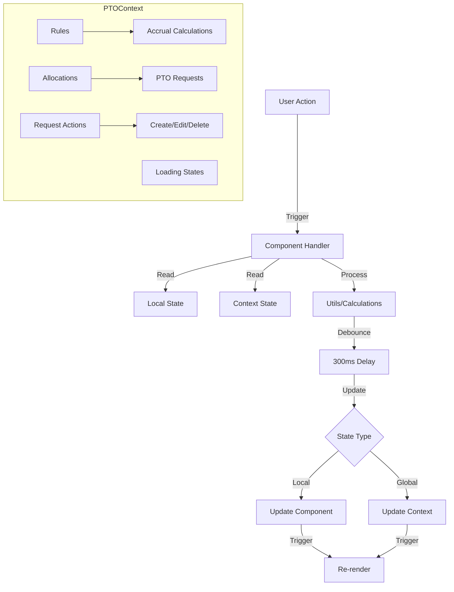

# PTO Feature Technical Documentation

## Tech Stack & Dependencies

### Core Technologies
- **React**: Frontend library for building user interfaces
- **TypeScript**: Static typing and enhanced developer experience
- **Vite**: Build tool and development server
- **ES Modules**: Using native JavaScript modules (import/export)

### Key Libraries
- **date-fns**: Date manipulation and formatting
- **lucide-react**: Icon components
- **tailwindcss**: Utility-first CSS framework

### Module System
- Using ES Modules (import/export) syntax
- No CommonJS (require/module.exports) usage
- All imports must be at the top level of files
- Dynamic imports should use the import() function, not require()

### Development Environment
- VSCode as primary IDE
- ESLint for code linting
- Prettier for code formatting
- TypeScript compiler for type checking

### Screenshot

### PTO Request


## Architecture Overview
The PTO feature is built using React with TypeScript, utilizing context for global state management and modular components for different functionalities.

### Component Architecture


### Data Flow


### State Management


## Core Components

### Pages

#### 1. PTO Page (`/src/pages/PTO.tsx`)
- Main PTO management interface
- Features:
  - PTO request creation/editing
  - Request list viewing with review status
  - Request filtering by type/status
  - Personal balance viewing
  - Detailed accrual rules display
- Key States:
  - `requests`: List of PTO requests
  - `filters`: Current filter settings
  - `selectedRequest`: Currently selected request for review
  - `editingRequest`: Request being edited
  - `loadingRules`: State for accrual rules updates

#### 2. Employees Page (`/src/pages/Employees.tsx`)
- Integrated PTO management features:
  - Employee PTO balances viewing
  - PTO data import
  - Start date tracking for PTO accrual
- Key States:
  - `ptoBalances`: Map of employee PTO balances
  - `selectedEmployee`: Employee being managed
  - `isImportOpen`: Import modal state

### Components

#### ImportEmployeesModal (`/src/components/employees/ImportEmployeesModal.tsx`)
- Handles employee data import with PTO balances
- Features:
  - CSV file upload and parsing
  - Data validation
  - PTO balance initialization
- Key States:
  - `file`: Selected CSV file
  - `importing`: Import progress state
  - `error`: Validation error messages

#### EmployeePTOBalances (`/src/components/employees/EmployeePTOBalances.tsx`)
- Displays employee PTO balances
- Features:
  - Vacation and sick leave balance display
  - Beginning balance display
  - Accrual information
- Props:
  ```typescript
  interface Props {
    employee: Employee;
    startDate: string;
  }
  ```

## Data Structures

### Employee PTO Structure
```typescript
interface Employee {
  pto: {
    vacation: {
      beginningBalance: number;
      ongoingBalance: number;
      firstYearRule: number;
    };
    sickLeave: {
      beginningBalance: number;
    };
  };
}
```

### Import Data Structure
```typescript
interface EmployeeImport {
  first_name: string;
  last_name: string;
  email: string;
  phone?: string;
  role: 'admin' | 'manager' | 'employee';
  department?: string;
  startDate: string;
  pto: {
    vacation: {
      beginningBalance: number;
      ongoingBalance: number;
      firstYearRule: number;
    };
    sickLeave: {
      beginningBalance: number;
    };
  };
}
```

## Implementation Notes

### Balance Calculation Strategy
- Vacation time calculation:
  ```typescript
  const calculateVacationBalance = (employee: Employee) => {
    const yearsOfService = differenceInYears(today, startDate);
    let accrued = 0;
    
    if (yearsOfService < 1) {
      // Pro-rate first year allocation
      const monthsWorked = differenceInMonths(today, startDate);
      accrued = Math.floor((40 * monthsWorked) / 12);
    } else {
      // Second year onwards: 80 hours
      accrued = 80;
    }
    
    return employee.pto.vacation.beginningBalance + accrued - usedVacationHours;
  };
  ```

- Sick leave calculation:
  ```typescript
  const calculateSickLeaveBalance = (employee: Employee) => {
    // 1 hour per 40 hours worked
    const accrued = Math.floor(totalWorkedHours / 40);
    return employee.pto.sickLeave.beginningBalance + accrued - usedSickLeaveHours;
  };
  ```

### Import Process
```typescript
const processImport = async (file: File) => {
  const text = await file.text();
  const lines = text.split('\n');
  const headers = lines[0].toLowerCase().split(',');
  
  return lines.slice(1)
    .filter(line => line.trim())
    .map(line => {
      const values = line.split(',');
      return {
        first_name: values[headers.indexOf('first_name')].trim(),
        last_name: values[headers.indexOf('last_name')].trim(),
        email: values[headers.indexOf('email')].trim(),
        phone: values[headers.indexOf('phone')]?.trim(),
        role: values[headers.indexOf('role')].trim(),
        department: values[headers.indexOf('department')]?.trim(),
        startDate: values[headers.indexOf('start_date')]?.trim(),
        pto: {
          vacation: {
            beginningBalance: Number(values[headers.indexOf('vacation_beginning_balance')] || '0'),
            ongoingBalance: 0,
            firstYearRule: 40
          },
          sickLeave: {
            beginningBalance: Number(values[headers.indexOf('sick_leave_beginning_balance')] || '0')
          }
        }
      };
    });
};
```

### State Management Strategy
- Uses React Context for global PTO state
- Local state for form handling and UI
- Proper type definitions for all data structures
- Validation at data entry points
- Error handling for edge cases

## PTO Request Actions
```typescript
interface PTOContextType {
  getPTOBalance: (employee: Employee, type: 'vacation' | 'sick_leave') => number;
  pendingRequests: PTORequest[];
  addPTORequest: (request: Omit<PTORequest, 'id' | 'status' | 'createdAt'>) => void;
  updatePTORequest: (requestId: string, status: 'approved' | 'rejected', reviewedBy: string) => void;
  deletePTORequest: (requestId: string) => void;
}

interface PTORequest {
  id: string;
  userId: string;
  startDate: string;
  endDate: string;
  type: PTOType;
  hours: number;
  reason: string;
  status: 'pending' | 'approved' | 'rejected';
  notes?: string;
  createdAt: string;
  createdBy?: string;
  reviewedBy?: string;
  reviewedAt?: string;
}
```

## Best Practices
1. Always validate imported data
2. Use proper type checking
3. Handle loading states
4. Provide meaningful error messages
5. Keep calculations consistent
6. Document all changes
7. Test edge cases
8. Follow naming conventions

## API Integration Points
(For future implementation)
- Employee data sync
- Timesheet integration
- Notification system
- Calendar service

## Performance Considerations
- Memoization of calculations
- Lazy loading of components
- Optimistic updates
- Batch processing
- Debounced state updates (300ms)
- Change detection before updates
- Cleanup of pending effects

## Integration with Reports
PTO data is displayed in various reports, particularly the Employee Hours Report. For detailed documentation about reports implementation and features, see [Reports Feature Technical Documentation](./reports-feature-technical.md).

## Timesheet Features

### Time Entry Management
- Clock in/out time editing for non-approved timesheets
- Automatic hours calculation using date-fns
- Individual entry hours display
- Total timesheet hours calculation and display
- Real-time hours updates on time changes

### Validation Rules
- Clock out time must be after clock in time
- All entries must have clock out times before submission
- Time validation on both individual edits and submission
- Prevents invalid time entries from being saved

### Status Management
- Read-only mode for approved timesheets
- Visual indicators for timesheet status
- Clear feedback for validation errors
- Automatic recalculation of hours on changes

## Security Notes
- Role-based access control
- Data validation
- Input sanitization
- Session management

## Code Standards & Best Practices

### Module Imports
- Always use ES Module syntax (import/export)
- Place all imports at the top level of the file
- Group imports in the following order:
  1. React and core libraries
  2. Third-party libraries
  3. Project utilities and types
  4. Components
  5. Assets and styles

### Mock Data Handling
- Import mock data using ES Module syntax
- Mock data should be imported at the top level
- Future implementation will replace mock data with API calls
- Mock data files location: src/lib/mock*.ts

### Component Structure
- Use TypeScript interfaces for props
- Implement proper type checking
- Keep components focused and modular
- Use hooks for shared logic
- Follow React best practices for state management

### Error Handling
- Implement proper error boundaries
- Use TypeScript to prevent type-related errors
- Handle edge cases gracefully
- Provide meaningful error messages

### Time Validation
- Validate time entries immediately on input
- Ensure clock out time is after clock in time
- Validate all entries before timesheet submission
- Use date-fns for consistent time calculations
- Round time calculations to 2 decimal places
- Handle timezone considerations properly
