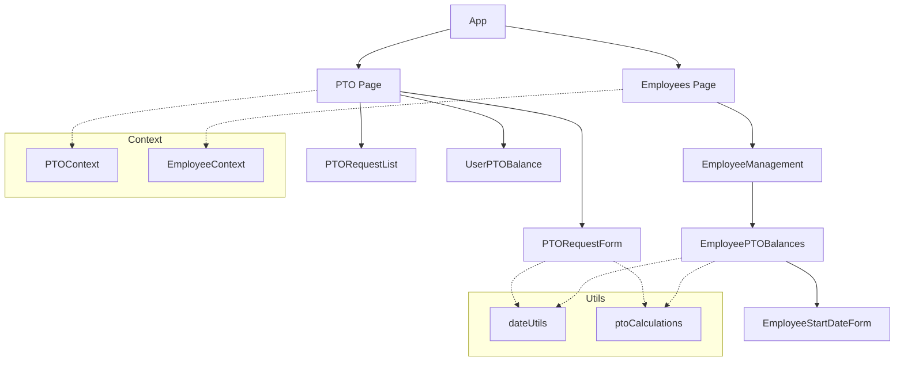
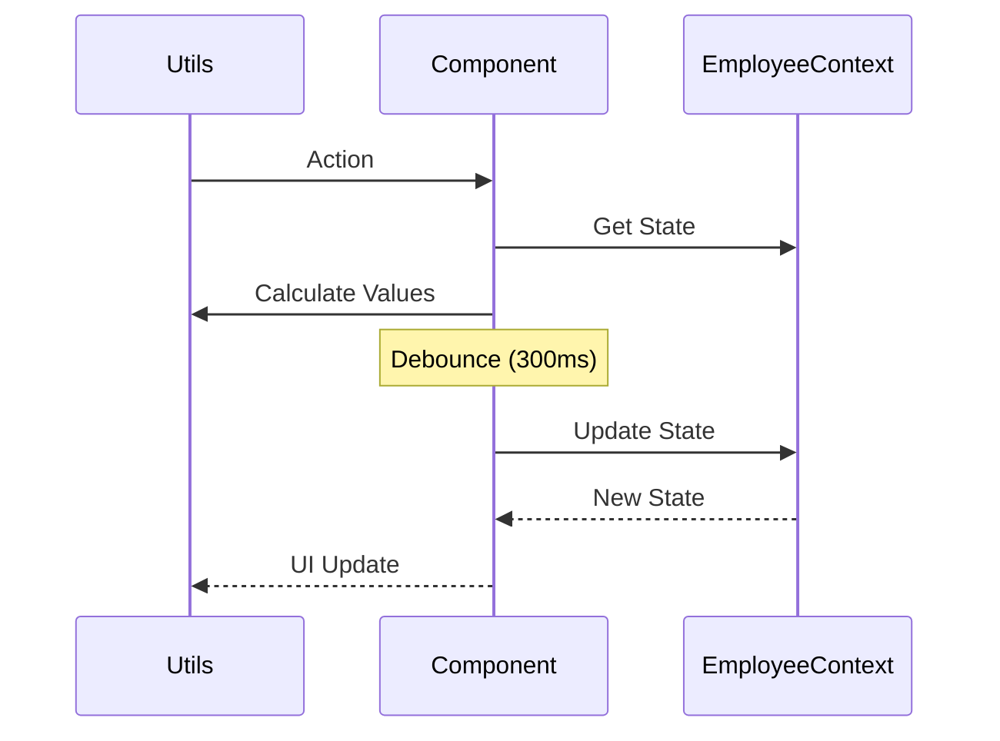
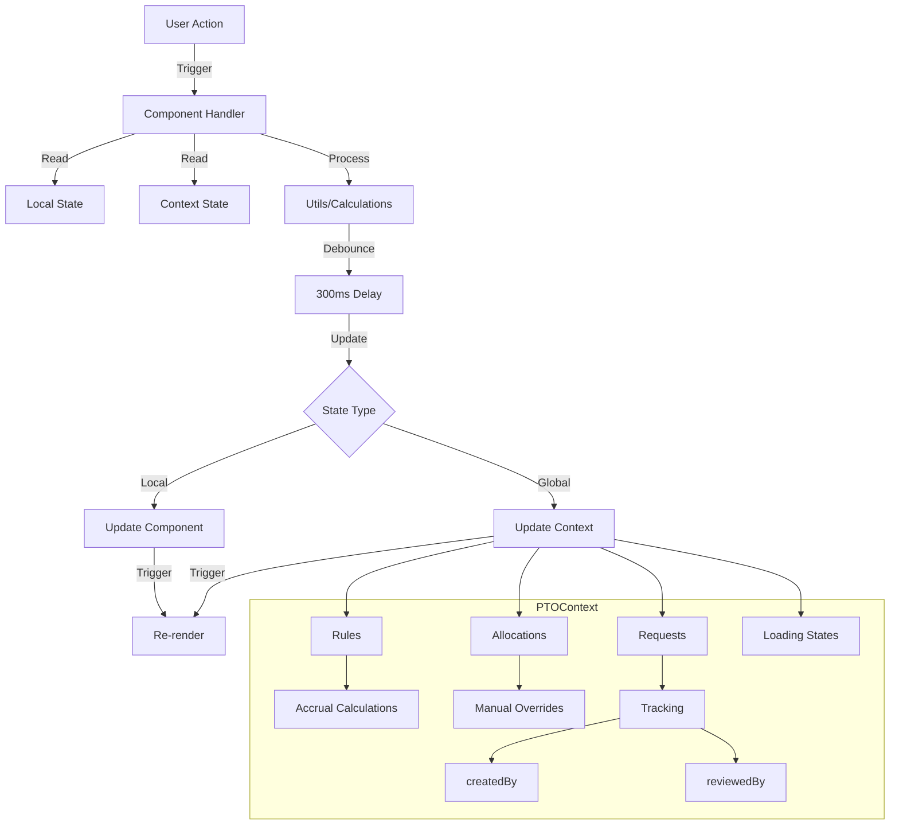

# PTO Feature Technical Documentation

## Tech Stack & Dependencies

### Core Technologies
- **React**: Frontend library for building user interfaces
- **TypeScript**: Static typing and enhanced developer experience
- **Vite**: Build tool and development server
- **ES Modules**: Using native JavaScript modules (import/export)

### Key Libraries
- **date-fns**: Date manipulation and formatting
- **lucide-react**: Icon components
- **tailwindcss**: Utility-first CSS framework

### Module System
- Using ES Modules (import/export) syntax
- No CommonJS (require/module.exports) usage
- All imports must be at the top level of files
- Dynamic imports should use the import() function, not require()

### Development Environment
- VSCode as primary IDE
- ESLint for code linting
- Prettier for code formatting
- TypeScript compiler for type checking

### Screenshot

### PTO Request


## Architecture Overview
The PTO feature is built using React with TypeScript, utilizing context for global state management and modular components for different functionalities.

### Component Architecture


Note: Employee PTO balances management has been moved to the Employees Management page for better organization and integration with employee data.

### Data Flow


### State Management


## Core Components

### Pages

#### 1. PTO Page (`/src/pages/PTO.tsx`)
- Main PTO management interface
- Features:
  - PTO request creation/editing with creator tracking
  - Request list viewing with review status
  - Request filtering by type/status
  - Personal balance viewing with manual override support
  - Detailed accrual rules display
- Key States:
  - `requests`: List of PTO requests with tracking metadata
  - `filters`: Current filter settings
  - `selectedRequest`: Currently selected request for review
  - `editingRequest`: Request being edited
  - `manualAllocations`: Map of manual PTO overrides
  - `loadingRules`: State for accrual rules updates

#### 2. Employees Page (`/src/pages/Employees.tsx`)
- Integrated PTO management features:
  - Employee PTO balances viewing
  - PTO allocation management
  - Start date tracking for PTO accrual
- Key States:
  - `ptoBalances`: Map of employee PTO balances
  - `allocations`: Current PTO allocations
  - `selectedEmployee`: Employee being managed

[Rest of the technical documentation from pto-feature.md...]

## Implementation Notes

### Balance Calculation Strategy
- Uses debounced effect (300ms) to prevent rapid successive updates
- Only updates balances when they've actually changed
- Uses stable dependencies (rules and employees.length)
- Properly cleans up pending timeouts
- Prevents infinite re-render cycles while maintaining functionality
- Supports manual allocation overrides for vacation and sick leave:
  ```typescript
  const calculateBalance = (type: PTOType) => {
    const baseBalance = calculateAccruedHours(type);
    const manualAdjustment = getManualAdjustment(employeeId, type);
    return Math.max(0, baseBalance + manualAdjustment);
  };
  ```
- Tracks used hours across pending and approved requests:
  ```typescript
  const getUsedHours = (type: PTOType) => {
    return requests
      .filter(r => r.type === type && r.status !== 'denied')
      .reduce((sum, r) => sum + r.hours, 0);
  };
  ```
- Ensures balances never go negative through max(0, balance) protection
- Handles both automatic accrual and manual allocation scenarios
- Integrates with request tracking system to:
  - Track creator/reviewer info
  - Maintain audit trail of changes
  - Provide detailed balance history

### State Management Strategy
- PTOContext for global PTO state including:
  - PTO requests and their status with tracking metadata
  - PTO allocations and balances with manual override support
  - Request tracking (creator/reviewer info with timestamps)
  - Accrual rules with loading states
  - Manual allocation overrides stored as:
    ```typescript
    {
      employeeId: string;
      type: 'vacation' | 'sickLeave';
      hours: number;
      reason: string;
      createdBy: string;
      createdAt: Date;
    }
    ```
  - Request tracking implemented as:
    ```typescript
    {
      requestId: string;
      createdBy: string;
      createdAt: Date;
      reviewedBy?: string;
      reviewedAt?: Date;
      status: 'pending' | 'approved' | 'denied';
    }
    ```
- EmployeeContext for employee data
- Local state for form handling and UI states
- Props for component-specific data
- Loading states for async operations
- Error states for failed operations

### Data Flow
1. User actions trigger component handlers
2. Handlers validate input and calculate balances
3. Updates are sent to PTOContext
4. Context updates trigger re-renders
5. Components reflect updated state with:
   - Current balances
   - Request status
   - Validation feedback

### Code Organization
- Components grouped by feature
- Utilities separated by function
- Types centralized in types.ts
- Constants in separate files

### Testing Considerations
- Component isolation
- Context mocking
- Date handling edge cases
- Balance calculation accuracy

## API Integration Points
(For future implementation)
- Employee data sync
- Timesheet integration
- Notification system
- Calendar service

## Performance Considerations
- Memoization of calculations
- Lazy loading of components
- Optimistic updates
- Batch processing
- Debounced state updates (300ms)
- Change detection before updates
- Cleanup of pending effects

## Integration with Reports
PTO data is displayed in various reports, particularly the Employee Hours Report. For detailed documentation about reports implementation and features, see [Reports Feature Technical Documentation](./reports-feature-technical.md).

## Timesheet Features

### Time Entry Management
- Clock in/out time editing for non-approved timesheets
- Automatic hours calculation using date-fns
- Individual entry hours display
- Total timesheet hours calculation and display
- Real-time hours updates on time changes

### Validation Rules
- Clock out time must be after clock in time
- All entries must have clock out times before submission
- Time validation on both individual edits and submission
- Prevents invalid time entries from being saved

### Status Management
- Read-only mode for approved timesheets
- Visual indicators for timesheet status
- Clear feedback for validation errors
- Automatic recalculation of hours on changes

## Security Notes
- Role-based access control
- Data validation
- Input sanitization
- Session management

## Code Standards & Best Practices

### Module Imports
- Always use ES Module syntax (import/export)
- Place all imports at the top level of the file
- Group imports in the following order:
  1. React and core libraries
  2. Third-party libraries
  3. Project utilities and types
  4. Components
  5. Assets and styles

### Mock Data Handling
- Import mock data using ES Module syntax
- Mock data should be imported at the top level
- Future implementation will replace mock data with API calls
- Mock data files location: src/lib/mock*.ts

### Component Structure
- Use TypeScript interfaces for props
- Implement proper type checking
- Keep components focused and modular
- Use hooks for shared logic
- Follow React best practices for state management

### Error Handling
- Implement proper error boundaries
- Use TypeScript to prevent type-related errors
- Handle edge cases gracefully
- Provide meaningful error messages

### Time Validation
- Validate time entries immediately on input
- Ensure clock out time is after clock in time
- Validate all entries before timesheet submission
- Use date-fns for consistent time calculations
- Round time calculations to 2 decimal places
- Handle timezone considerations properly
