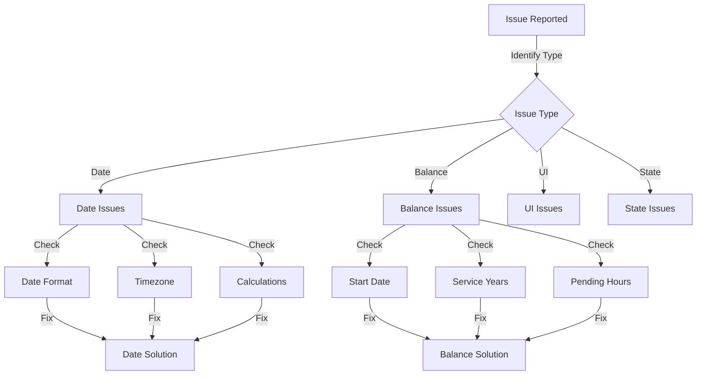
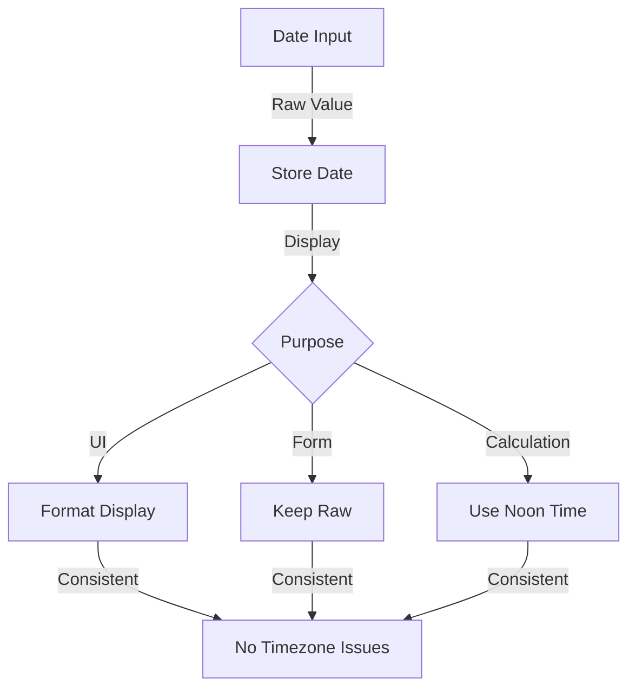
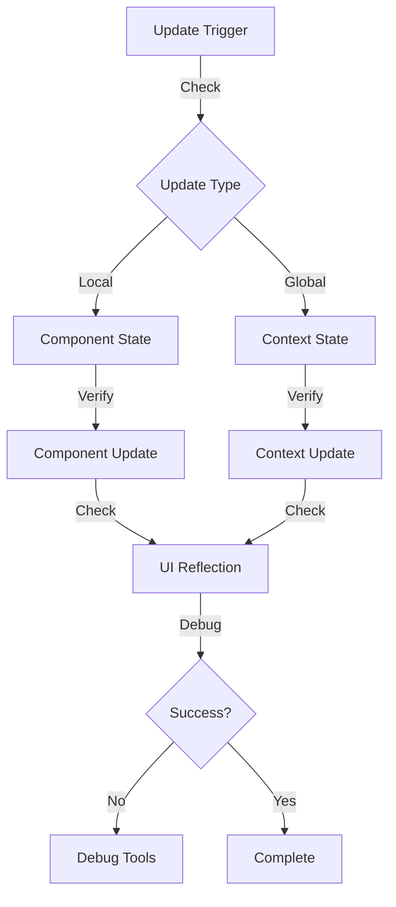

# PTO Feature Troubleshooting Guide

## Common Issues and Solutions

### Debugging Flow


### Date Handling Flow


### State Update Flow


### Date Handling Issues

#### 1. Date Selection Shows Wrong Date
**Problem**: When selecting a date in forms (e.g., 01/12/2024), it shows as different date (e.g., 01/11/2024)
```typescript
// Wrong way
setStartDate(formatDateForInput(e.target.value));

// Correct way
setStartDate(e.target.value);
```

**Solution**:
1. Use raw date input values
2. Avoid unnecessary date formatting
3. Keep YYYY-MM-DD format throughout

#### 2. Timezone Inconsistencies
**Problem**: Dates shift due to timezone conversions
```typescript
// Problematic code
new Date(dateString).toISOString().split('T')[0]

// Fixed code
const [year, month, day] = dateString.split('-');
new Date(year, month - 1, day, 12);  // Use noon time
```

**Solution**:
1. Use noon time (12:00) for date objects
2. Avoid timezone conversions
3. Keep dates in local time

### Balance Calculation Issues

#### 1. Incorrect Vacation Balance
**Problem**: Balance doesn't match years of service
```typescript
// Debug steps
const startDate = new Date(employee.startDate);
const today = new Date();
console.log({
  startDate,
  today,
  yearsOfService: differenceInYears(today, startDate)
});
```

**Solution**:
1. Verify start date is correct
2. Check years calculation
3. Validate balance tiers

#### 2. Sick Leave Calculation
**Problem**: Sick leave hours not accruing correctly
```typescript
// Debug steps
console.log({
  totalHours: timesheets.reduce((sum, t) => sum + t.totalHours, 0),
  sickLeaveHours: Math.floor(totalHours / 40)
});
```

**Solution**:
1. Verify timesheet hours
2. Check 40-hour calculation
3. Validate rounding

### Form Validation Issues

#### 1. Hours Validation Fails
**Problem**: Business days calculation incorrect
```typescript
// Debug steps
const businessDays = calculateBusinessDays(startDate, endDate);
console.log({
  startDate,
  endDate,
  businessDays,
  expectedHours: businessDays * 8
});
```

**Solution**:
1. Check weekend exclusion
2. Verify 8-hour day math
3. Validate date range

#### 2. Balance Validation Issues
**Problem**: Available balance check fails
```typescript
// Debug steps
console.log({
  availableBalance: getAvailableHours(type),
  pendingHours: getPendingHours(type),
  requestedHours: hours
});
```

**Solution**:
1. Check balance calculation
2. Verify pending requests
3. Validate request hours

### UI/UX Issues

#### 1. Form Reset Problems
**Problem**: Form doesn't reset properly
```typescript
// Solution
useEffect(() => {
  if (isOpen) {
    setFormData({
      ...initialState,
      startDate: getTodayForInput()
    });
  }
}, [isOpen]);
```

#### 2. Display Formatting
**Problem**: Inconsistent date display
```typescript
// Use consistent formatting
import { formatDateForDisplay } from '../../utils/dateUtils';
// ...
<span>{formatDateForDisplay(date)}</span>
```

### State Management Issues

#### 1. Context Updates
**Problem**: Updates not reflecting
```typescript
// Debug
console.log('Before update:', employees);
updateEmployee(id, updates);
console.log('After update:', employees);
```

**Solution**:
1. Check context provider
2. Verify update function
3. Check component re-render

#### 2. Form State
**Problem**: State not updating
```typescript
// Use controlled components
<input
  value={startDate}
  onChange={e => setStartDate(e.target.value)}
/>
```

## Debugging Tools

### Console Logging
```typescript
// Date debugging
console.log({
  rawDate: date,
  dateObject: new Date(date),
  formatted: formatDateForDisplay(date)
});

// Balance debugging
console.log({
  employee,
  yearsOfService,
  calculatedBalance,
  pendingRequests
});
```

### React DevTools
1. Check component props
2. Inspect state changes
3. Verify context values

### Network Tab
1. API responses
2. Request payloads
3. Error messages

## Prevention Strategies

### Code Reviews
1. Check date handling
2. Verify calculations
3. Test edge cases

### Testing
1. Unit tests for calculations
2. Integration tests for forms
3. E2E tests for workflows

### Documentation
1. Keep docs updated
2. Document edge cases
3. Note known issues

## Support Escalation

### Level 1: Development Team
- Code-level issues
- Bug fixes
- Feature updates

### Level 2: System Admin
- Data issues
- User permissions
- System configuration

### Level 3: Vendor Support
- Platform issues
- Integration problems
- Major bugs
