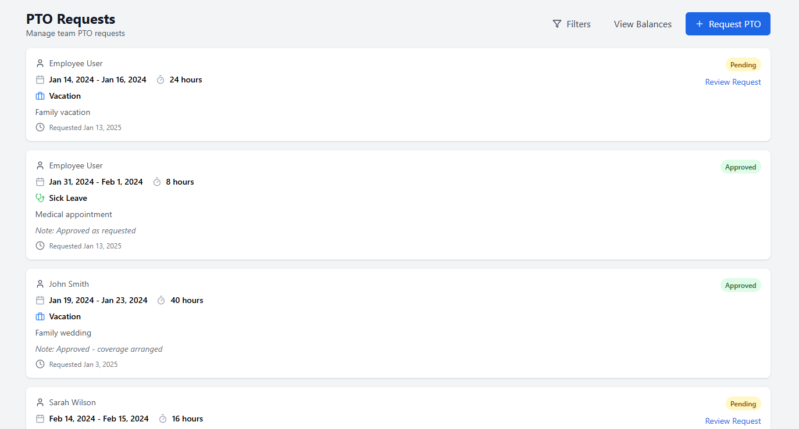
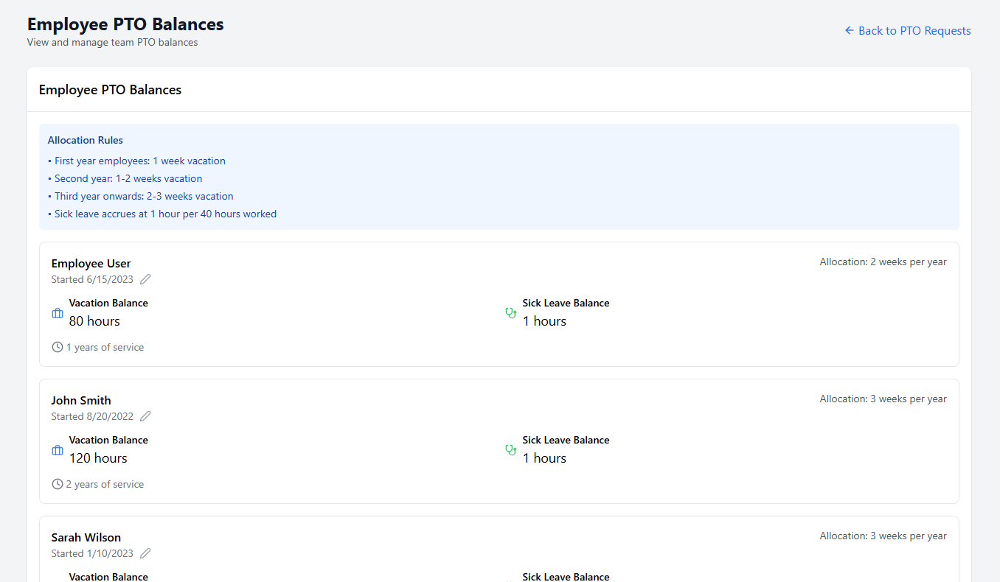

# PTO (Paid Time Off) Feature Documentation

## Overview
The PTO feature manages employee vacation and sick leave balances, requests, and approvals. It includes automatic balance calculations based on employment duration and worked hours.

## Core Components

### Pages

#### 1. PTO Page (`/src/pages/PTO.tsx`)


- Main PTO management interface
- Features:
  - PTO request creation/editing
  - Request list viewing
  - Request filtering
  - Balance viewing
- Key States:
  - `requests`: List of PTO requests
  - `filters`: Current filter settings
  - `selectedRequest`: Currently selected request for review
  - `editingRequest`: Request being edited

#### 2. PTOBalances Page (`/src/pages/PTOBalances.tsx`)


- Admin view for managing employee PTO balances
- Features:
  - View all employee balances
  - Edit employment start dates
  - View allocation rules
- Uses EmployeeContext for state management

### Components

#### 1. PTORequestForm (`/src/components/pto/PTORequestForm.tsx`)

- Form for creating/editing PTO requests
- Features:
  - Date range selection
  - PTO type selection (vacation/sick leave)
  - Hours calculation
  - Balance validation
- Props:
  - `onSubmit`: Handler for form submission
  - `initialData`: Optional data for editing
  - `pendingRequests`: Current pending requests

#### 2. EmployeePTOBalances (`/src/components/pto/EmployeePTOBalances.tsx`)
- Displays PTO balances for all employees
- Features:
  - Shows vacation and sick leave balances
  - Employment duration display
  - Start date editing
- Props:
  - `employees`: List of employees
  - `onUpdateStartDate`: Handler for start date updates

#### 3. UserPTOBalance (`/src/components/pto/UserPTOBalance.tsx`)
- Individual employee balance display
- Shows:
  - Vacation balance
  - Sick leave balance
  - Current allocation rate

#### 4. EmployeeStartDateForm (`/src/components/pto/EmployeeStartDateForm.tsx`)
- Modal form for editing employment start date
- Features:
  - Date selection
  - Validation for future dates
- Props:
  - `employee`: Employee being edited
  - `onSubmit`: Update handler
  - `onClose`: Modal close handler

### Utilities

#### 1. PTO Calculations (`/src/utils/ptoCalculations.ts`)
- Business logic for PTO calculations
- Functions:
  - `calculateVacationBalance`: Based on years of service
    - First year: 40 hours (1 week)
    - Second year: 80 hours (2 weeks)
    - Third year+: 120 hours (3 weeks)
  - `calculateSickLeaveBalance`: Based on worked hours
    - 1 hour per 40 hours worked
  - `getVacationAllocationText`: Text display of allocation

#### 2. Date Utilities (`/src/utils/dateUtils.ts`)
- Date handling functions
- Functions:
  - `formatDateForInput`: Formats dates for input fields
  - `formatDateForDisplay`: Formats dates for display
  - `getTodayForInput`: Gets today's date in input format

### State Management

#### 1. EmployeeContext (`/src/contexts/EmployeeContext.tsx`)
- Global employee state management
- Features:
  - Employee data storage
  - CRUD operations
  - Start date updates
- Methods:
  - `updateEmployee`
  - `addEmployee`
  - `deleteEmployee`

## Business Rules

### Vacation Time
1. First year employees: 1 week (40 hours)
2. Second year: 2 weeks (80 hours)
3. Third year onwards: 3 weeks (120 hours)

### Sick Leave
- Accrues at 1 hour per 40 hours worked
- Calculated from timesheet entries

### Request Validation
1. Cannot exceed available balance
2. Hours must match business days in range
3. Cannot request future dates
4. Requires reason for request

## Date Handling

### Date Storage and Format
- All dates stored in YYYY-MM-DD format (e.g., "2024-01-12")
- Employee start dates stored in this format in Employee object
- PTO request dates (start/end) also use this format

### Date Input Handling
- HTML date inputs provide dates in YYYY-MM-DD format
- No formatting applied to input values to prevent timezone issues
- Direct storage of input values in state and database

### Date Display
- Dates displayed using localized format via `formatDateForDisplay`
- Start dates shown in employee list and PTO balances view
- Request dates shown in request list and review forms

### Date Calculations
- Years of service calculated using `differenceInYears` from date-fns
- Business days calculation excludes weekends
- All calculations use noon time (12:00) to avoid timezone edge cases

### Date Validation
- Start dates cannot be in the future
- PTO request dates must be:
  - Not in the past
  - End date after or equal to start date
  - Within available balance period

## PTO Calculations

### Vacation Balance
```typescript
// Example calculation
function calculateVacationBalance(employee: Employee): number {
  const yearsOfService = differenceInYears(new Date(), new Date(employee.startDate));
  
  if (yearsOfService < 1) return 40;     // 1 week
  if (yearsOfService < 2) return 80;     // 2 weeks
  return 120;                            // 3 weeks
}
```

### Sick Leave Accrual
```typescript
// Example calculation
function calculateSickLeaveBalance(timesheets: TimesheetEntry[]): number {
  const totalWorkedHours = timesheets.reduce((total, timesheet) => {
    return total + timesheet.totalHours;
  }, 0);
  
  return Math.floor(totalWorkedHours / 40); // 1 hour per 40 worked
}
```

### Business Days Calculation
```typescript
// Example calculation
function calculateBusinessDays(startDate: Date, endDate: Date): number {
  let count = 0;
  const current = new Date(startDate);
  
  while (current <= endDate) {
    if (!isWeekend(current)) {
      count++;
    }
    current.setDate(current.getDate() + 1);
  }
  
  return count;
}
```

## Key Files
```
src/
├── pages/
│   ├── PTO.tsx
│   └── PTOBalances.tsx
├── components/pto/
│   ├── PTORequestForm.tsx
│   ├── EmployeePTOBalances.tsx
│   ├── UserPTOBalance.tsx
│   └── EmployeeStartDateForm.tsx
├── utils/
│   ├── ptoCalculations.ts
│   └── dateUtils.ts
├── contexts/
│   └── EmployeeContext.tsx
└── lib/
    ├── types.ts
    └── mockUsers.ts
```

## Common Tasks

### Adding a New PTO Request
1. User clicks "Request PTO" button
2. PTORequestForm opens
3. User selects dates and type
4. System calculates hours
5. System validates against balance
6. Request saved to state

### Editing Start Date
1. Admin clicks edit icon on employee
2. EmployeeStartDateForm opens
3. Admin selects new date
4. System updates via EmployeeContext
5. Balances recalculate automatically

### Reviewing PTO Request
1. Admin views request in list
2. Clicks review button
3. Reviews details and balance
4. Approves or rejects with notes
5. System updates request status

## Troubleshooting Common Issues

### Date Handling Issues
1. Date Shifting Problems
   - Symptom: Selected date shows as different date in display
   - Cause: Timezone conversion during date handling
   - Solution: Use raw date input values without formatting
   - Example: `setStartDate(e.target.value)` instead of formatting

2. Invalid Date Display
   - Symptom: Dates show as "Invalid Date"
   - Cause: Incorrect date string format
   - Solution: Ensure YYYY-MM-DD format for all date storage
   - Check: `console.log(new Date("2024-01-12"))` should work

3. Date Calculations
   - Symptom: Incorrect years of service
   - Cause: Date boundary edge cases
   - Solution: Use noon time for calculations
   - Example: `new Date(year, month - 1, day, 12)`

### Balance Calculation Issues
1. Incorrect Vacation Balance
   - Check employment duration calculation
   - Verify start date is correct
   - Log years of service calculation

2. Wrong Sick Leave Hours
   - Verify timesheet hours summation
   - Check 40-hour calculation
   - Validate rounding behavior

### Form Submission Issues
1. Invalid Hours Validation
   - Check business days calculation
   - Verify weekend exclusion
   - Confirm 8-hour day calculation

2. Balance Validation Failures
   - Log available balance calculation
   - Check pending requests inclusion
   - Verify balance deduction timing

## Future Considerations
1. Real timesheet integration for sick leave
2. Balance carryover rules
3. Holiday calendar integration
4. Multiple PTO types
5. Batch request processing

## Version History

### v1.0.0
- Initial PTO management implementation
- Basic vacation and sick leave tracking
- Admin approval workflow

### v1.1.0
- Added employment start date editing
- Fixed date handling issues
- Improved balance calculations
