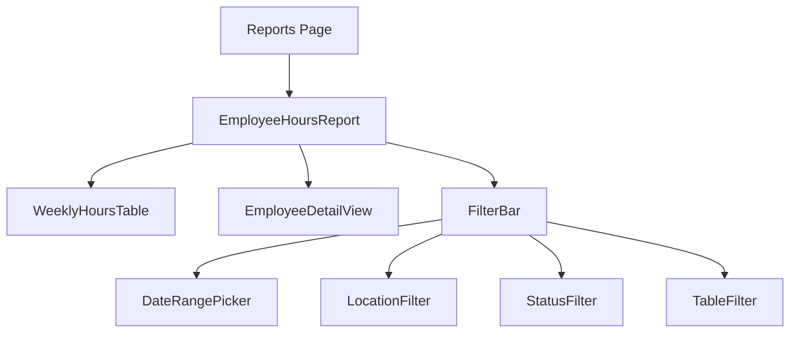

# Reports Feature Technical Documentation

## Overview
The reports feature provides comprehensive analytics and data visualization for employee time tracking, including regular hours, overtime, PTO, and other metrics.

### Screenshot

#### Employee Hours Report


## Tech Stack & Dependencies
- React with TypeScript
- date-fns for date calculations
- TailwindCSS for styling
- Supabase for data storage and querying

## Database Schema

### Weekly Hours View
```sql
CREATE OR REPLACE VIEW weekly_employee_hours AS
WITH time_entry_hours AS (
  SELECT 
    te.user_id,
    te.organization_id,
    te.job_location_id,
    te.status,
    -- Normalize date to America/Los_Angeles timezone
    DATE(te.clock_in AT TIME ZONE 'UTC' AT TIME ZONE 'America/Los_Angeles') as entry_date,
    -- Calculate worked hours accounting for breaks
    ROUND(
      (EXTRACT(EPOCH FROM (te.clock_out - te.clock_in))/3600 - COALESCE(te.total_break_minutes, 0)/60.0)::numeric,
      2
    ) as worked_hours,
    te.service_type as type
  FROM time_entries te
  WHERE
    te.clock_out IS NOT NULL
)
SELECT 
  e.id,
  e.first_name || ' ' || e.last_name as name,
  e.organization_id,
  -- Daily hours with timezone consideration
  ROUND(SUM(CASE WHEN to_char(teh.entry_date, 'ID')::integer = 1 THEN teh.worked_hours ELSE 0 END)::numeric, 2) as monday,
  ROUND(SUM(CASE WHEN to_char(teh.entry_date, 'ID')::integer = 2 THEN teh.worked_hours ELSE 0 END)::numeric, 2) as tuesday,
  ROUND(SUM(CASE WHEN to_char(teh.entry_date, 'ID')::integer = 3 THEN teh.worked_hours ELSE 0 END)::numeric, 2) as wednesday,
  ROUND(SUM(CASE WHEN to_char(teh.entry_date, 'ID')::integer = 4 THEN teh.worked_hours ELSE 0 END)::numeric, 2) as thursday,
  ROUND(SUM(CASE WHEN to_char(teh.entry_date, 'ID')::integer = 5 THEN teh.worked_hours ELSE 0 END)::numeric, 2) as friday,
  ROUND(SUM(CASE WHEN to_char(teh.entry_date, 'ID')::integer = 6 THEN teh.worked_hours ELSE 0 END)::numeric, 2) as saturday,
  ROUND(SUM(CASE WHEN to_char(teh.entry_date, 'ID')::integer = 7 THEN teh.worked_hours ELSE 0 END)::numeric, 2) as sunday,
  -- Weekly totals and overtime
  total_regular,
  total_ot,
  vacation_hours,
  sick_leave_hours,
  vacation_balance,
  sick_leave_balance
FROM employees e
  INNER JOIN organization_members om ON e.member_id = om.id
  LEFT JOIN time_entry_hours teh ON om.user_id = teh.user_id
GROUP BY 
  e.id, e.first_name, e.last_name, e.organization_id;
```

### Access Control Function
```sql
CREATE OR REPLACE FUNCTION get_weekly_employee_hours(
  start_date timestamp with time zone,
  end_date timestamp with time zone,
  org_id uuid
)
RETURNS SETOF weekly_hours_result
SECURITY DEFINER
LANGUAGE plpgsql
AS $$
BEGIN
  -- Check organization access
  IF NOT EXISTS (
    SELECT 1 FROM organization_members 
    WHERE user_id = auth.uid() 
    AND organization_id = org_id
  ) THEN
    RAISE EXCEPTION 'Not authorized';
  END IF;

  -- Return filtered data
  RETURN QUERY
  SELECT * FROM weekly_employee_hours
  WHERE organization_id = org_id
  AND entry_date >= start_date
  AND entry_date < end_date;
END;
$$;
```

## Core Reports

### Employee Hours Report
Provides detailed tracking of employee time and PTO:

#### Data Structure
```typescript
interface WeeklyEmployeeHours {
  id: string;
  name: string;
  jobLocationIds: string[];
  hours: {
    monday: number;
    tuesday: number;
    wednesday: number;
    thursday: number;
    friday: number;
    saturday: number;
    sunday: number;
  };
  totalRegular: number;
  totalOT: number;
  vacationHours: number;
  sickLeaveHours: number;
  vacationBalance: number;
  sickLeaveBalance: number;
}

interface ReportFilters {
  startDate: Date;
  endDate: Date;
  employeeIds?: string[];
  jobLocationIds?: string[];
}
```

#### Features
- Weekly breakdown of hours by day
- Regular and overtime hours tracking
  - Weekly overtime calculation (hours over 40)
  - Proper timezone handling
- Vacation hours tracking
  - Hours used in current period
  - Current balance with accrual rules
  - First year pro-rated allocation
- Sick leave tracking
  - Hours used in current period
  - Current balance tracking
- Interactive employee selection
- CSV export capabilities
- Location-based filtering
- Status-based filtering

#### Integration Points
- Time Entry System
  - Clock in/out times
  - Break tracking
  - Job location assignment
- PTO System
  - Vacation balance calculations
  - Sick leave tracking
  - Leave type categorization
- Organization System
  - Automatic context handling
  - Access control
  - Data isolation

## Component Architecture



### Key Components
- Reports.tsx: Main page component
- EmployeeHoursReport.tsx: Primary report component
- WeeklyHoursTable.tsx: Displays weekly hours data
- EmployeeDetailView.tsx: Shows detailed employee information
- FilterBar.tsx: Container for all filter components
- LocationFilter.tsx: Handles location-based filtering
- StatusFilter.tsx: Manages status-based filtering
- TableFilter.tsx: Generic table filtering component
- ExportButton.tsx: Handles CSV export

## State Management
- Uses React hooks for local state
- ReportsContext for global report state
- Implements custom hooks:
  - useReportFilters: Manages filter state
  - useTableSort: Handles table sorting
  - useEmployeeDetailFilters: Controls employee detail view
  - useDebounce: Debounces filter changes

## Code Organization
- Components: `/src/components/reports/`
  - Main report components
  - Reusable tables
  - Filter controls
  - Export components
- Services: `/src/services/`
  - reports.ts: Main service layer
  - API integration
  - Data processing
- Contexts: `/src/contexts/`
  - ReportsContext.tsx: Global state
- Database: `/supabase/migrations/`
  - Weekly hours view
  - Access control functions
  - Debug functions

## Best Practices

### Data Handling
- Proper timezone handling (America/Los_Angeles)
- Weekly overtime calculations
- Break time accounting
- Organization-level data isolation
- Proper numeric rounding

### UI/UX Guidelines
- Consistent table layouts
- Clear data presentation
- Interactive filtering
- Loading states
- Error handling
- Retry mechanisms

### Performance
- Optimized database views
- Proper indexing
- Memoized components
- Debounced filters
- Data caching

### Security
- Organization-level isolation
- Role-based access control
- Input validation
- Query parameter sanitization

## Future Enhancements
- Additional report types
- Enhanced export formats (PDF, Excel)
- Advanced data visualization
- Custom report builder
- Scheduled report delivery
