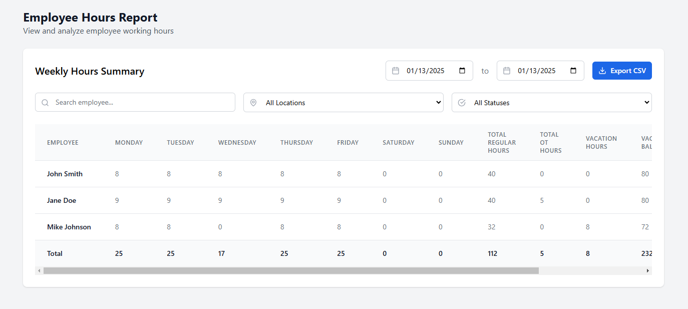
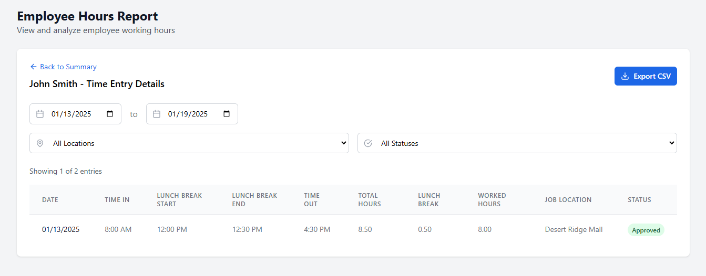
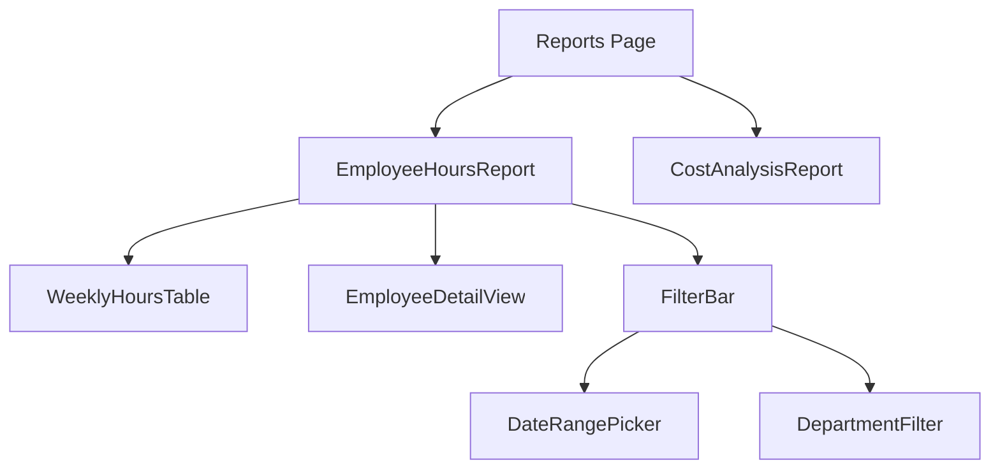

# Reports Feature Technical Documentation

## Overview
The reports feature provides comprehensive analytics and data visualization for employee time tracking, including regular hours, overtime, PTO, and other metrics.

### Screenshot

#### Employee Hours Report




## Tech Stack & Dependencies
- React with TypeScript
- date-fns for date calculations
- TailwindCSS for styling

## Core Reports

### Employee Hours Report
Provides detailed tracking of employee time and PTO:

#### Data Structure
```typescript
interface WeeklyEmployeeHours {
  id: string;
  name: string;
  hours: {
    monday: number;
    tuesday: number;
    wednesday: number;
    thursday: number;
    friday: number;
    saturday: number;
    sunday: number;
  };
  totalRegular: number;
  totalOT: number;
  vacationHours: number;
  sickLeaveHours: number;
  vacationBalance: number;
  sickLeaveBalance: number;
}
```

#### Features
- Weekly breakdown of hours by day
- Regular and overtime hours tracking
- Vacation hours tracking
  - Hours used in current period
  - Current balance
  - Integration with PTO system
- Sick leave tracking
  - Hours used in current period
  - Current balance
  - Accrual tracking
- Interactive employee selection
- Export capabilities

#### Integration Points
- PTO System
  - Uses vacation balance calculations from ptoCalculations.ts
  - Reflects approved PTO requests
  - Updates balances based on used hours
- Timesheet System
  - Pulls regular and overtime hours
  - Validates against approved timesheets
- Employee Data
  - Basic employee information
  - Department and role filtering

### Cost Analysis Report
(Documentation for other reports will be added here)

## Component Architecture



## State Management
- Uses React hooks for local state
- Implements custom hooks for:
  - Report filters (useReportFilters)
  - Data sorting (useTableSort)
  - Employee details (useEmployeeDetailFilters)

## Code Organization
- Components: `/src/components/reports/`
  - Main report components
  - Reusable tables
  - Filter controls
- Utilities: `/src/utils/`
  - Date formatting
  - Data calculations
  - Export functions
- Types: `/src/lib/types.ts`
- Mock Data: `/src/lib/mockReportData.ts`

## Best Practices

### Data Handling
- Implement proper data fetching patterns
- Use TypeScript interfaces for all data structures
- Handle loading and error states
- Implement data caching where appropriate

### UI/UX Guidelines
- Consistent table layouts
- Clear data presentation
- Interactive filtering
- Responsive design
- Accessible tables and controls

### Performance
- Implement pagination for large datasets
- Memoize expensive calculations
- Optimize re-renders
- Lazy load report components

## Future Enhancements
- Additional report types
- Advanced filtering options
- Custom report builder
- Data visualization improvements
- Real-time updates
