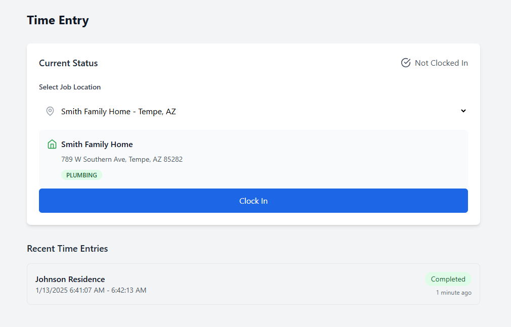
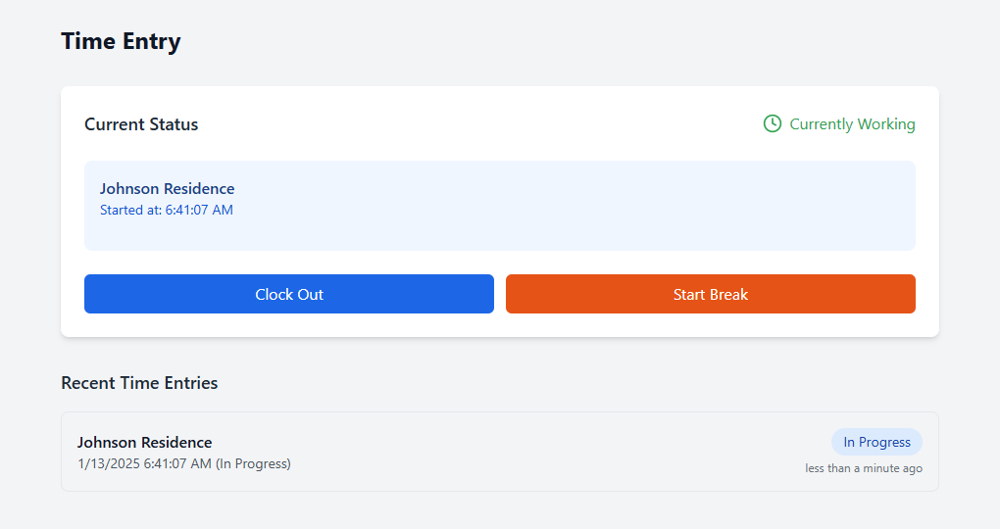
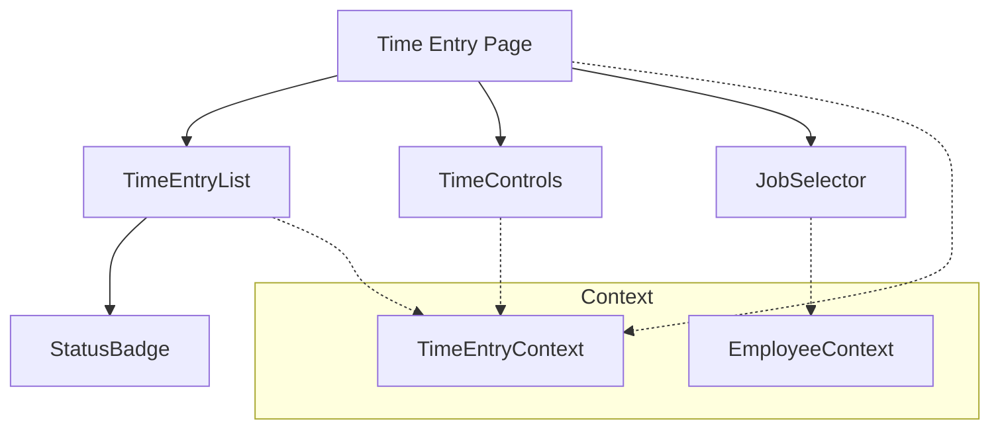
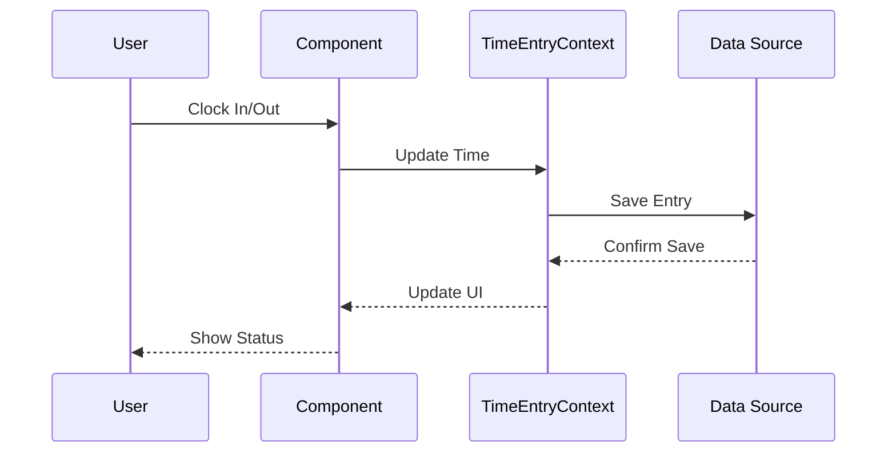

# Time Entry Feature Technical Documentation

## Tech Stack & Dependencies

### Core Technologies
- **React**: Frontend library for building user interfaces
- **TypeScript**: Static typing and enhanced developer experience
- **TailwindCSS**: Utility-first CSS framework

### Key Libraries
- **date-fns**: Date manipulation and formatting
- **lucide-react**: Icon components

## Architecture Overview
The Time Entry feature enables employees to track their work hours, select job locations, and manage their time entries with real-time validation and status tracking.

### Screenshot



### Component Architecture


### Data Flow


## Core Components

### TimeEntryList
- Display time entries in chronological order
- Real-time updates
- Entry status indicators
- Edit capabilities for non-approved entries
- Filtering options
- Pagination

### TimeControls
- Clock in/out functionality
- Break time tracking
- Real-time duration calculation
- Validation checks
- Error handling
- Status updates

### JobSelector
- Job location selection
- Quick search
- Recent locations
- Favorites
- Validation
- Basic location assignment

### StatusBadge
- Visual status indicators
- Status transitions
- Color coding
- Tooltips
- Interactive states

## State Management
- Uses TimeEntryContext for global state
- Local state for form inputs
- Real-time updates
- Status tracking
- Error handling

## Code Organization
- Components: `/src/components/time-entry/`
  - Entry management
  - Time controls
  - Selection components
  - Status indicators
- Utilities: `/src/utils/`
  - Time calculations
  - Validation functions
  - Format helpers

## Data Structure
```typescript
interface TimeEntry {
  id: string;
  employeeId: string;
  jobLocationId: string;
  date: string;
  clockIn: string;
  clockOut: string | null;
  breakStart: string | null;
  breakEnd: string | null;
  totalHours: number;
  breakDuration: number;
  status: 'active' | 'completed' | 'approved' | 'rejected';
  notes: string;
}

interface TimeControls {
  isClockingIn: boolean;
  isOnBreak: boolean;
  currentEntry: TimeEntry | null;
  lastEntry: TimeEntry | null;
}
```

## Best Practices

### Time Calculations
- Use date-fns for consistent calculations
- Handle timezone differences
- Round to nearest minute/quarter
- Validate overlapping entries
- Break time handling
- Maximum hours validation

### Performance
- Optimized re-renders
- Efficient time updates
- Memoized calculations
- Cached location data
- Debounced inputs

### Data Handling
- Type-safe operations
- Real-time validation
- Error boundaries
- Loading states
- Optimistic updates

### UI/UX Guidelines
- Clear status indicators
- Real-time feedback
- Intuitive controls
- Mobile-friendly design
- Error messages
- Success confirmations
- Loading states

### Security
- Role-based access
- Entry validation
- Data sanitization
- Audit logging
- Session management

## Integration Points
- Job Locations system
- Employee management
- Timesheet system
- Reports system
- Payroll system (future)

## Validation Rules
- Clock out after clock in
- Break end after break start
- No future entries
- Maximum shift duration
- Minimum break duration
- Overlap prevention
- Valid job location assignment

## Future Enhancements
- Location Tracking
  - GPS location verification
  - Geofencing capabilities
  - Location-based clock in/out
  - Travel time tracking
- Mobile Features
  - Mobile app integration
  - Offline support
  - Biometric verification
- Advanced Features
  - Automated breaks
  - Schedule integration
  - Voice commands
  - QR code clock-in

## Error Handling
- Invalid time entries
- Network errors
- Validation failures
- Conflict resolution
- User feedback
- Recovery options

## Testing Considerations
- Time calculation tests
- Validation logic tests
- Component unit tests
- Integration tests
- Edge case handling
- Mobile responsiveness
- Offline behavior
