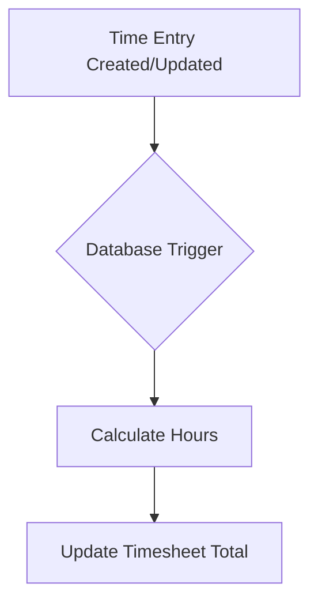
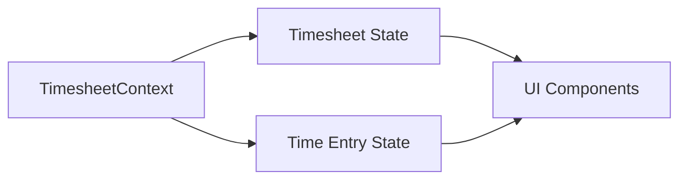

# Timesheet Feature Architecture

## Core Concepts

### Timesheets
A timesheet represents a collection of time entries for a specific employee within a defined period (typically a week). It has its own lifecycle:

1. **Draft**: Initial state where employee can add/edit time entries
2. **Submitted**: Employee has completed their entries and submitted for review
3. **Approved**: Manager has reviewed and approved the timesheet
4. **Rejected**: Manager has reviewed and rejected the timesheet (requires revision)

### Time Entries
Individual records of time worked, associated with specific job locations. Each entry includes:
- Start and end times
- Break duration
- Job location
- Notes/description
- Automatic total hours calculation

## Architecture Overview

### Database Layer
- Uses Postgres with Supabase
- Leverages Row Level Security (RLS) for data access control
- Implements database triggers for automatic calculations
- Enforces data integrity through constraints

### Service Layer
Follows the Repository pattern used in job-locations feature:
- Clear separation of concerns
- Typed interfaces
- Consistent error handling
- Minimal business logic

### State Management
Uses React Context for state management:
- Separate contexts for timesheets and time entries
- Optimistic updates for better UX
- Proper error handling and loading states

## Security Model

### Row Level Security Policies
1. **Timesheets**
   - Users can view/edit their own timesheets
   - Admins can view/edit all timesheets in their organization
   - Draft timesheets can only be edited by owners
   - Submitted timesheets can only be approved/rejected by admins

2. **Time Entries**
   - Users can view/edit their own entries
   - Admins can view all entries in their organization
   - Entries can only be edited when timesheet is in draft status

## Data Flow

### Creating Time Entries
1. User creates/updates time entry
2. Database trigger calculates hours
3. Trigger updates timesheet total
4. UI reflects changes immediately (optimistic update)
5. Error handling if operation fails

### Timesheet Submission
1. User submits timesheet
2. System validates all entries
3. Status changes to 'submitted'
4. Notifications sent to reviewers
5. UI updates to reflect new status

## Performance Considerations

### Database Optimizations
- Indexes on frequently queried columns
- Efficient joins through proper relationships
- Trigger-based calculations to avoid application-level computation

### Frontend Optimizations
- Pagination for large datasets
- Caching through React Query
- Optimistic updates for better UX

## Error Handling

### Database Level
- Constraints ensure data integrity
- Clear error messages for constraint violations
- Proper error propagation to application layer

### Application Level
- Typed error responses
- Consistent error handling patterns
- User-friendly error messages
- Proper error state management in UI

## Testing Strategy

### Unit Tests
- Service functions
- Utility functions
- Component rendering

### Integration Tests
- Database triggers
- RLS policies
- API endpoints

### E2E Tests
- Complete workflows
- User interactions
- Error scenarios

## Future Considerations

### Scalability
- Designed for large datasets
- Efficient query patterns
- Proper indexing strategy

### Extensibility
- Modular component design
- Clear separation of concerns
- Well-defined interfaces

### Maintenance
- Consistent code patterns
- Clear documentation
- Type safety throughout