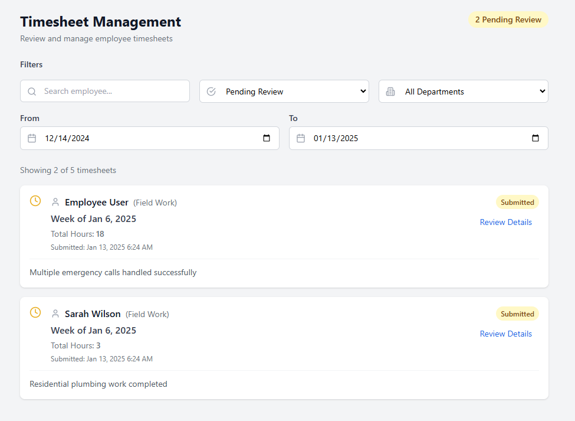
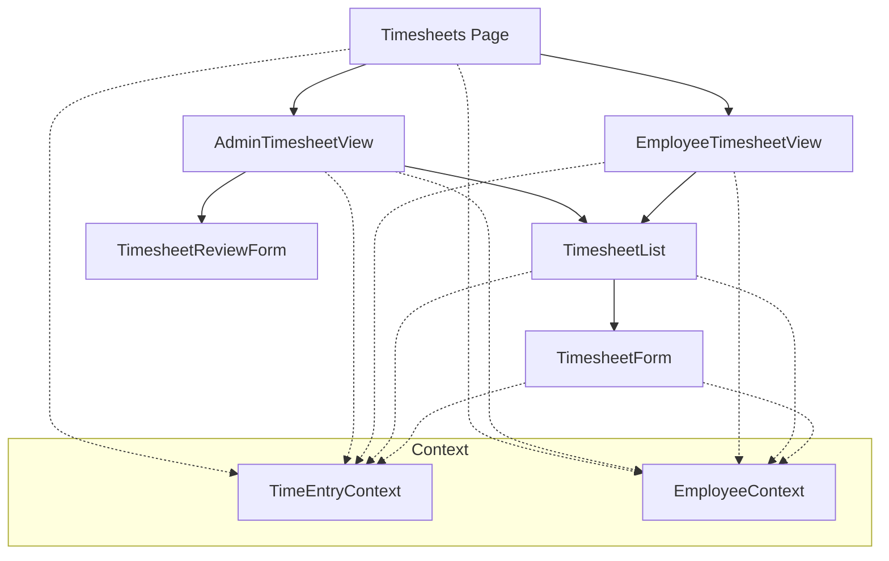
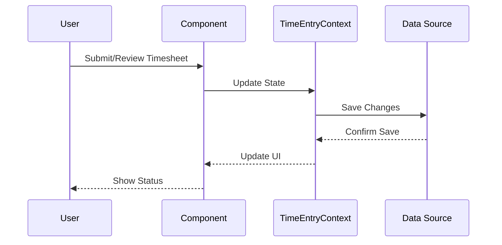

# Timesheets Feature Technical Documentation

## Tech Stack & Dependencies

### Core Technologies
- **React**: Frontend library for building user interfaces
- **TypeScript**: Static typing and enhanced developer experience
- **TailwindCSS**: Utility-first CSS framework

### Key Libraries
- **date-fns**: Date manipulation and formatting
- **lucide-react**: Icon components

## Architecture Overview
The Timesheets feature provides comprehensive timesheet management with role-specific views for employees and administrators, including submission, review, and approval workflows.

### Screenshot


### Component Architecture


### Data Flow


## Core Components

### AdminTimesheetView
- Overview of all employee timesheets
- Batch approval capabilities
- Filter and search functionality
- Status tracking
- Export options
- Audit trail

### EmployeeTimesheetView
- Personal timesheet management
- Time entry submission
- Status tracking
- History view
- Notifications
- Quick actions

### TimesheetForm
- Time entry input
- Break time tracking
- Job location selection
- Notes and comments
- Validation rules
- Auto-save functionality
- Error handling

### TimesheetList
- List/Grid view of timesheets
- Sorting capabilities
- Filter options
- Status indicators
- Quick actions
- Pagination

### TimesheetReviewForm
- Detailed timesheet review
- Approval/Rejection workflow
- Comment system
- Validation checks
- History tracking
- Notification triggers

## State Management
- Uses TimeEntryContext for global state
- Local state for form handling
- Optimistic updates
- Error state management
- Loading state tracking

## Code Organization
- Components: `/src/components/timesheets/`
  - View components
  - Form components
  - List components
  - Review functionality
- Utilities: `/src/utils/`
  - Time calculations
  - Validation functions
  - Format helpers

## Data Structure
```typescript
interface Timesheet {
  id: string;
  employeeId: string;
  weekStartDate: string;
  weekEndDate: string;
  entries: TimeEntry[];
  totalRegularHours: number;
  totalOvertimeHours: number;
  status: 'draft' | 'submitted' | 'approved' | 'rejected';
  submittedAt: string | null;
  approvedBy: string | null;
  approvedAt: string | null;
  comments: TimesheetComment[];
  version: number;
}

interface TimesheetComment {
  id: string;
  timesheetId: string;
  userId: string;
  comment: string;
  createdAt: string;
  isInternal: boolean;
}
```

## Best Practices

### Time Calculations
- Use date-fns for consistent calculations
- Handle timezone differences
- Round to nearest quarter hour
- Overtime calculations
- Break time handling
- Holiday consideration

### Performance
- Optimized form handling
- Efficient list rendering
- Memoized calculations
- Cached data management
- Batch operations

### Data Handling
- Type-safe operations
- Real-time validation
- Error boundaries
- Loading states
- Optimistic updates
- Version control

### UI/UX Guidelines
- Clear status indicators
- Intuitive form layout
- Responsive design
- Loading indicators
- Error messages
- Success feedback
- Confirmation dialogs

### Security
- Role-based access control
- Data validation
- Audit logging
- Session management
- Version control
- Change tracking

## Integration Points
- Time Entry system
- Employee management
- PTO system
- Reports system
- Payroll system
- Notification system

## Validation Rules
- Required fields
- Time entry validation
- Break time rules
- Overtime rules
- Submission deadlines
- Approval workflows
- Version conflicts

## Future Enhancements
- Mobile app support
- Automated approvals
- Advanced reporting
- Bulk operations
- Template system
- Digital signatures
- Compliance tracking
- Integration with HR systems

## Error Handling
- Form validation errors
- API error handling
- Version conflicts
- Network errors
- Retry mechanisms
- User feedback
- Recovery options

## Testing Considerations
- Component unit tests
- Form validation tests
- Time calculation tests
- Workflow tests
- Integration tests
- Role-based tests
- Edge case handling
