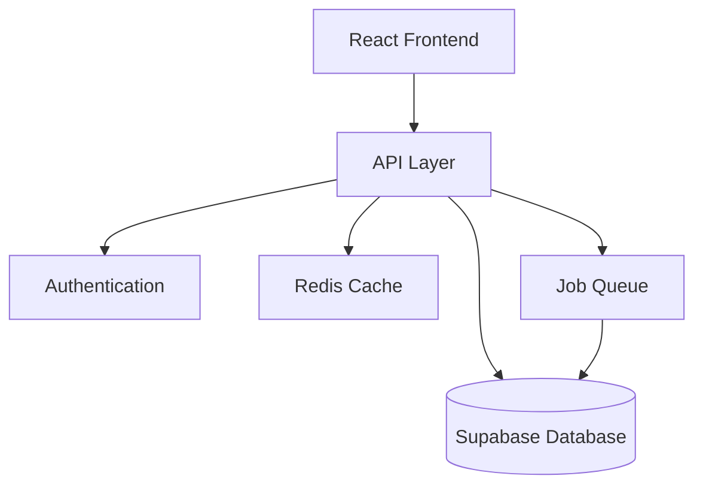
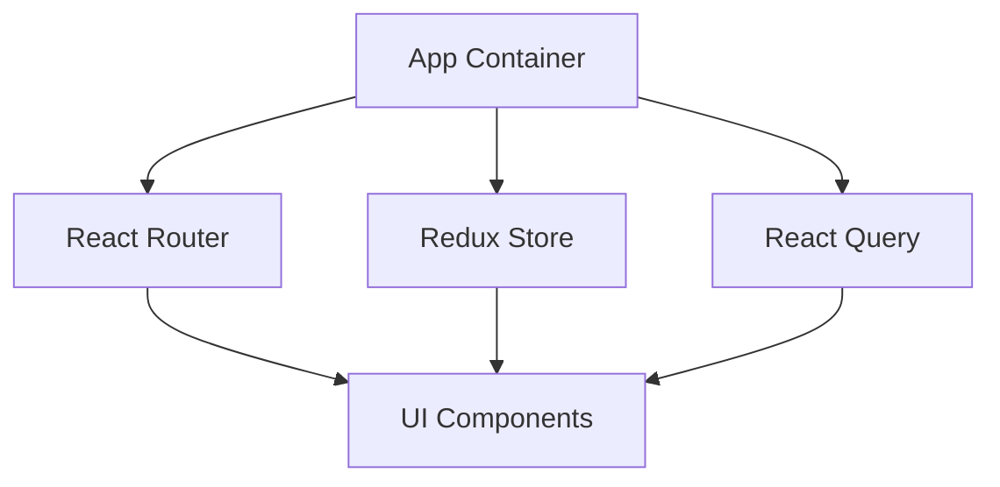
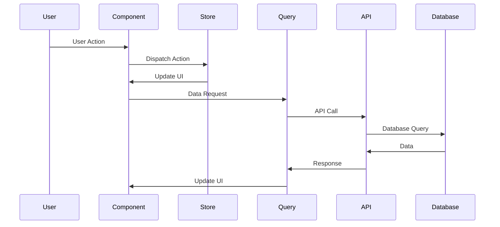
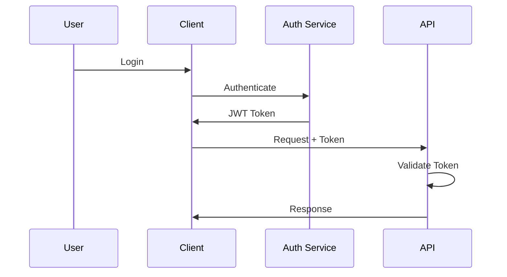
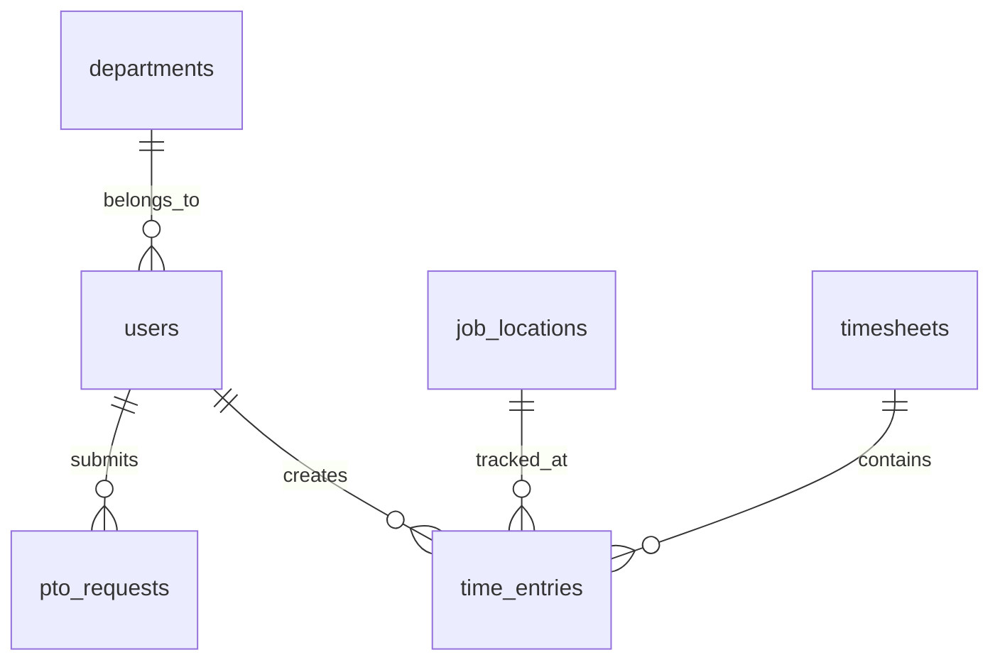

# Architecture Overview

This document provides a comprehensive overview of the ClockFlow application architecture.

## System Architecture



## Technology Stack

### Frontend
- **Framework**: React 18 with TypeScript
- **Build Tool**: Vite
- **State Management**: Redux Toolkit
- **API Client**: React Query
- **UI Components**: Custom components with Tailwind CSS
- **Forms**: React Hook Form with Zod validation
- **Testing**: Jest and React Testing Library

### Backend (Supabase)
- **Database**: PostgreSQL
- **Authentication**: Supabase Auth
- **API**: RESTful with PostgREST
- **Real-time**: Supabase Realtime
- **Storage**: Supabase Storage

## Core Components

### Frontend Architecture



1. **Component Layer**
   - Presentational Components
   - Container Components
   - Layout Components
   - Feature-specific Components

2. **State Management**
   - Redux for global state
   - React Query for server state
   - Local state with hooks
   - Context for theme/auth

3. **Routing**
   - React Router v6
   - Protected routes
   - Role-based access
   - Lazy loading

### Data Flow



## Feature Modules

### Time Tracking Module

```typescript
src/features/timeTracking/
├── components/
│   ├── TimeEntry.tsx
│   ├── TimeSheet.tsx
│   └── Timer.tsx
├── hooks/
│   ├── useTimeEntry.ts
│   └── useTimer.ts
├── services/
│   └── timeEntryService.ts
└── store/
    ├── timeEntrySlice.ts
    └── selectors.ts
```

### PTO Management Module

```typescript
src/features/pto/
├── components/
│   ├── PTOCalendar.tsx
│   ├── PTORequest.tsx
│   └── PTOBalance.tsx
├── hooks/
│   └── usePTO.ts
├── services/
│   └── ptoService.ts
└── store/
    ├── ptoSlice.ts
    └── selectors.ts
```

## Security Architecture

### Authentication Flow



### Authorization Levels

1. **Public**
   - Login page
   - Registration
   - Password reset

2. **Employee**
   - Time entry
   - PTO requests
   - View reports

3. **Manager**
   - Approve time
   - Manage team
   - Department reports

4. **Admin**
   - System settings
   - User management
   - Global reports

## Database Architecture

### Core Tables



### Data Access Patterns

1. **Read Patterns**
   - Time entry queries
   - Report generation
   - Dashboard metrics

2. **Write Patterns**
   - Time entry creation
   - PTO requests
   - Approvals

## Performance Optimizations

### Frontend Optimizations

1. **Code Splitting**
   ```typescript
   const TimeSheet = lazy(() => import('./TimeSheet'));
   ```

2. **Memoization**
   ```typescript
   const memoizedValue = useMemo(() => compute(value), [value]);
   ```

3. **Virtual Lists**
   ```typescript
   <VirtualList
     items={timeEntries}
     renderItem={(entry) => <TimeEntryRow entry={entry} />}
   />
   ```

### API Optimizations

1. **Caching Strategy**
   - Response caching
   - Query result caching
   - Cache invalidation

2. **Batch Operations**
   - Bulk time entry updates
   - Batch report generation
   - Mass approvals

## Scalability Considerations

### Horizontal Scaling

1. **Frontend**
   - CDN distribution
   - Static asset optimization
   - Progressive loading

2. **Backend**
   - Database replication
   - Read replicas
   - Connection pooling

### Monitoring and Observability

1. **Metrics**
   - Response times
   - Error rates
   - User activity

2. **Logging**
   - Application logs
   - Audit trails
   - Error tracking

## Development Workflow

### Local Development

1. **Setup**
   ```bash
   npm install
   npm run dev
   ```

2. **Testing**
   ```bash
   npm run test
   npm run test:e2e
   ```

### Deployment Pipeline

1. **Build Process**
   ```bash
   npm run build
   ```

2. **Deployment**
   - Automated via CI/CD
   - Environment promotion
   - Rollback capability

## Future Considerations

1. **Planned Improvements**
   - Mobile application
   - Offline support
   - Advanced analytics

2. **Technical Debt**
   - Code refactoring
   - Test coverage
   - Documentation updates

3. **Scalability**
   - Multi-region support
   - Enhanced caching
   - Performance optimization
