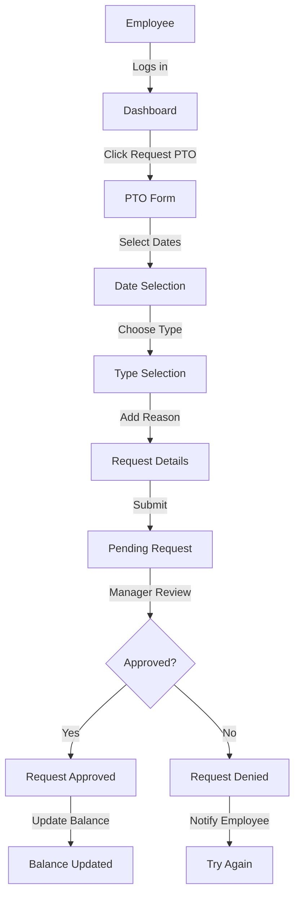
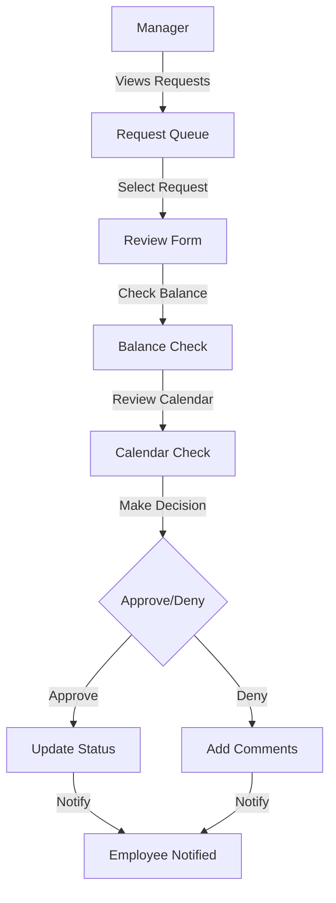
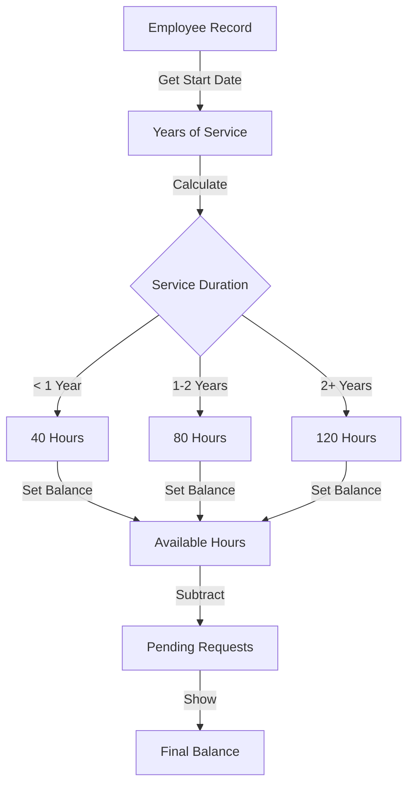
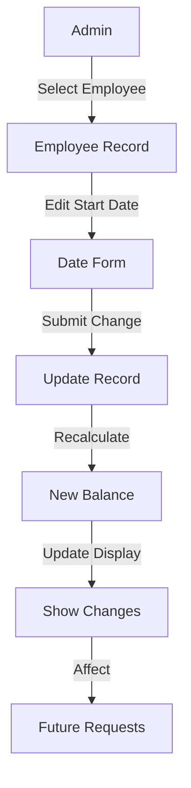

# PTO Feature Overview

## What is the PTO Feature?
The PTO (Paid Time Off) feature helps manage employee time off, including both vacation time and sick leave. It provides an easy way for employees to request time off and for managers to review and manage these requests.

## Key Features

### For Employees
1. **View PTO Balances**
   - See available vacation hours
   - Track sick leave balance
   - View upcoming time off

2. **Request Time Off**
   - Select dates
   - Choose type (vacation or sick leave)
   - Provide reason
   - See status of requests

### For Managers/Admins
1. **Manage Requests**
   - Review employee requests
   - Approve or deny with comments
   - View team calendar

2. **Track Balances**
   - Monitor team PTO usage
   - View individual balances
   - Manage employment dates

## How PTO is Calculated

### Vacation Time
Based on years of service:
- First year: 1 week (40 hours)
- Second year: 2 weeks (80 hours)
- Third year onwards: 3 weeks (120 hours)

### Sick Leave
- Earns 1 hour for every 40 hours worked
- Calculated automatically from work hours
- No maximum cap

## Common Workflows

### Requesting Time Off

### Reviewing Requests (Managers)

### Balance Calculation

### Employment Date Update

## Business Rules

### Request Rules
- Cannot request more time than available
- Must provide reason for request
- Cannot request past dates
- Minimum half-day increments

### Balance Rules
- Vacation time allocated based on service years
- Sick leave earned through worked hours
- Pending requests counted against balance
- Balance updates immediately upon approval

## Reports and Views

### Employee View
- Current balances
- Request history
- Pending requests
- Upcoming time off

### Manager View
- Team calendar
- Balance summary
- Request queue
- Usage reports

## Recent Updates (v1.1.0)

### New Features
- Employment date management
- Improved balance calculations
- Better date handling
- Enhanced validation

### Coming Soon
- Holiday calendar integration
- Balance carryover rules
- Mobile app support
- Team calendar view

## Support
For technical issues or questions about using the PTO feature, please contact your system administrator or the IT support team.
