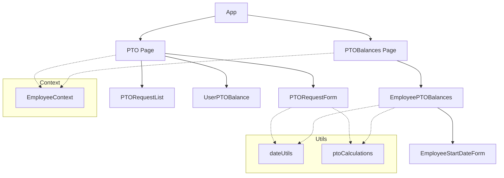
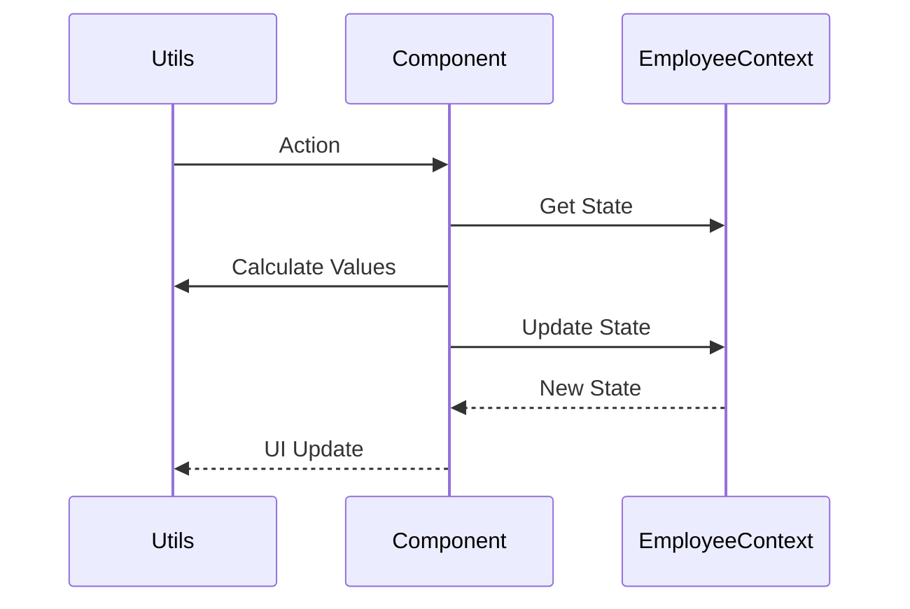
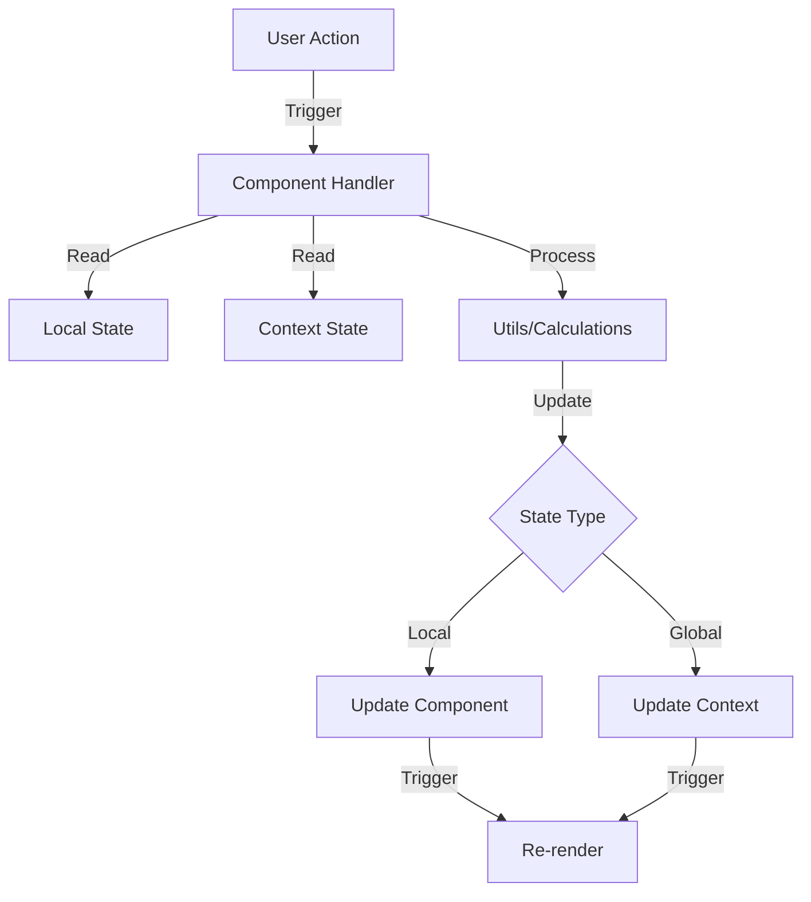

# PTO Feature Technical Documentation

## Architecture Overview
The PTO feature is built using React with TypeScript, utilizing context for global state management and modular components for different functionalities.

### Component Architecture

### Data Flow

### State Management

## Core Components

### Pages

#### 1. PTO Page (`/src/pages/PTO.tsx`)
- Main PTO management interface
- Features:
  - PTO request creation/editing
  - Request list viewing
  - Request filtering
  - Balance viewing
- Key States:
  - `requests`: List of PTO requests
  - `filters`: Current filter settings
  - `selectedRequest`: Currently selected request for review
  - `editingRequest`: Request being edited

[Rest of the technical documentation from pto-feature.md...]

## Implementation Notes

### State Management Strategy
- EmployeeContext for global employee data
- Local state for form handling
- Props for component-specific data

### Data Flow
1. User actions trigger component handlers
2. Handlers update local state or context
3. Context updates trigger re-renders
4. Components reflect updated state

### Code Organization
- Components grouped by feature
- Utilities separated by function
- Types centralized in types.ts
- Constants in separate files

### Testing Considerations
- Component isolation
- Context mocking
- Date handling edge cases
- Balance calculation accuracy

## API Integration Points
(For future implementation)
- Employee data sync
- Timesheet integration
- Notification system
- Calendar service

## Performance Considerations
- Memoization of calculations
- Lazy loading of components
- Optimistic updates
- Batch processing

## Security Notes
- Role-based access control
- Data validation
- Input sanitization
- Session management
