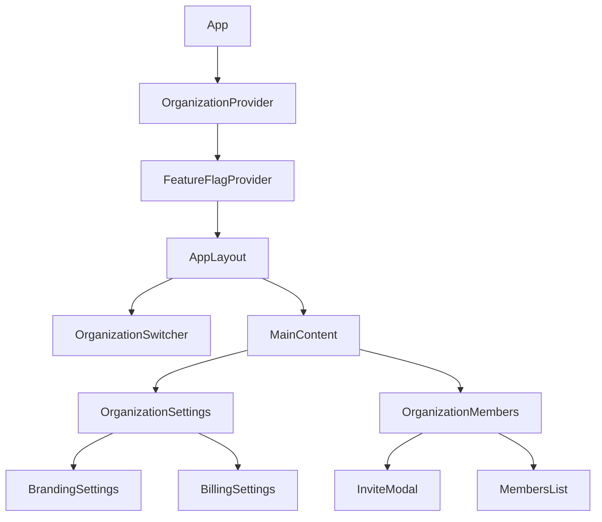

# Multi-Tenancy UI Implementation Plan

This document outlines the UI components and implementation plan for adding multi-tenancy support to ClockFlow.

## Component Structure

### 1. Authentication and Organization Setup

#### SignUpFlow
```typescript
// src/components/auth/SignUpFlow.tsx
interface SignUpFlowProps {
  onComplete: (user: User, organization: Organization) => void;
}

const SignUpFlow: React.FC<SignUpFlowProps> = ({ onComplete }) => {
  const [step, setStep] = useState<'auth' | 'organization'>('auth');
  
  return (
    <div className="signup-flow">
      {step === 'auth' ? (
        <AuthForm onComplete={() => setStep('organization')} />
      ) : (
        <OrganizationCreate onComplete={onComplete} />
      )}
    </div>
  );
};
```

#### OrganizationCreate
```typescript
// src/components/organization/OrganizationCreate.tsx
interface OrganizationCreateProps {
  onComplete: (organization: Organization) => void;
}

const OrganizationCreate: React.FC<OrganizationCreateProps> = ({ onComplete }) => {
  const [formData, setFormData] = useState({
    name: '',
    slug: '',
    planType: 'basic'
  });

  return (
    <form className="organization-create">
      <h2>Set Up Your Organization</h2>
      <Input
        label="Organization Name"
        value={formData.name}
        onChange={(e) => {
          setFormData({
            ...formData,
            name: e.target.value,
            slug: generateSlug(e.target.value)
          });
        }}
      />
      <Input
        label="URL Slug"
        value={formData.slug}
        onChange={(e) => setFormData({ ...formData, slug: e.target.value })}
      />
      <PlanSelector
        value={formData.planType}
        onChange={(plan) => setFormData({ ...formData, planType: plan })}
      />
      <Button onClick={handleSubmit}>Create Organization</Button>
    </form>
  );
};
```

### 2. Organization Management

#### OrganizationSettings
```typescript
// src/components/organization/OrganizationSettings.tsx
const OrganizationSettings: React.FC = () => {
  const { organization } = useOrganization();
  const tabs = ['General', 'Branding', 'Billing', 'Security'];

  return (
    <div className="organization-settings">
      <Tabs>
        <Tab id="general">
          <GeneralSettings organization={organization} />
        </Tab>
        <Tab id="branding">
          <BrandingSettings organization={organization} />
        </Tab>
        <Tab id="billing">
          <BillingSettings organization={organization} />
        </Tab>
        <Tab id="security">
          <SecuritySettings organization={organization} />
        </Tab>
      </Tabs>
    </div>
  );
};
```

#### OrganizationMembers
```typescript
// src/components/organization/OrganizationMembers.tsx
const OrganizationMembers: React.FC = () => {
  const { members, invite, remove, updateRole } = useOrganizationMembers();

  return (
    <div className="organization-members">
      <div className="members-header">
        <h2>Team Members</h2>
        <Button onClick={() => setShowInvite(true)}>Invite Member</Button>
      </div>
      <MembersList
        members={members}
        onUpdateRole={updateRole}
        onRemove={remove}
      />
      <InviteModal
        isOpen={showInvite}
        onClose={() => setShowInvite(false)}
        onInvite={invite}
      />
    </div>
  );
};
```

### 3. Context and State Management

#### OrganizationContext
```typescript
// src/contexts/OrganizationContext.tsx
interface OrganizationContextType {
  organization: Organization | null;
  setOrganization: (org: Organization) => void;
  loading: boolean;
}

export const OrganizationContext = createContext<OrganizationContextType>(null!);

export function OrganizationProvider({ children }: { children: React.ReactNode }) {
  const [organization, setOrganization] = useState<Organization | null>(null);
  const [loading, setLoading] = useState(true);
  const { user } = useAuth();

  useEffect(() => {
    if (user) {
      loadUserOrganization();
    }
  }, [user]);

  return (
    <OrganizationContext.Provider value={{ organization, setOrganization, loading }}>
      {children}
    </OrganizationContext.Provider>
  );
}
```

#### FeatureFlagContext
```typescript
// src/contexts/FeatureFlagContext.tsx
interface FeatureFlags {
  [key: string]: boolean;
}

export const FeatureFlagContext = createContext<FeatureFlags>({});

export function FeatureFlagProvider({ children }: { children: React.ReactNode }) {
  const { organization } = useOrganization();
  const [features, setFeatures] = useState<FeatureFlags>({});

  useEffect(() => {
    if (organization) {
      const planFeatures = PLAN_FEATURES[organization.planType];
      setFeatures(planFeatures);
    }
  }, [organization]);

  return (
    <FeatureFlagContext.Provider value={features}>
      {children}
    </FeatureFlagContext.Provider>
  );
}
```

### 4. Layout Components

#### OrganizationSwitcher
```typescript
// src/components/layout/OrganizationSwitcher.tsx
const OrganizationSwitcher: React.FC = () => {
  const { organizations, currentOrg, switchOrganization } = useOrganizations();

  return (
    <Dropdown>
      <DropdownTrigger>
        <div className="org-trigger">
          <Avatar src={currentOrg.logoUrl} />
          <span>{currentOrg.name}</span>
        </div>
      </DropdownTrigger>
      <DropdownContent>
        {organizations.map(org => (
          <DropdownItem
            key={org.id}
            onClick={() => switchOrganization(org.id)}
          >
            <Avatar src={org.logoUrl} />
            <span>{org.name}</span>
          </DropdownItem>
        ))}
        <DropdownItem onClick={() => navigate('/organizations/new')}>
          <PlusIcon />
          <span>Create Organization</span>
        </DropdownItem>
      </DropdownContent>
    </Dropdown>
  );
};
```

## Implementation Plan

### Phase 1: Core Organization Setup (Week 1-2)

1. **Authentication Flow Updates**
   - Update sign-up flow to include organization creation
   - Implement organization context and provider
   - Create organization selection UI for users with multiple organizations

2. **Basic Organization Management**
   - Create organization settings page
   - Implement organization name and slug management
   - Add basic branding options (logo, colors)

### Phase 2: Member Management (Week 3-4)

1. **Member Invitation System**
   - Create invitation UI and flow
   - Implement email invitation system
   - Add invitation acceptance flow

2. **Role Management**
   - Create role management UI
   - Implement permission system
   - Add member list with role controls

### Phase 3: Subscription and Billing (Week 5-6)

1. **Plan Management**
   - Create plan selection UI
   - Implement Stripe integration
   - Add billing information management

2. **Usage Tracking**
   - Create usage dashboard
   - Implement usage limits
   - Add upgrade prompts

### Phase 4: Enterprise Features (Week 7-8)

1. **Advanced Branding**
   - Custom CSS injection
   - White-labeling options
   - Custom domain support

2. **API Management**
   - API key generation UI
   - Usage tracking dashboard
   - Documentation portal

## Component Dependencies



## Styling Guidelines

1. **Organization Branding**
```typescript
// src/styles/organization.ts
export const generateOrganizationStyles = (branding: OrganizationBranding) => css`
  :root {
    --primary-color: ${branding.colors.primary};
    --secondary-color: ${branding.colors.secondary};
    --logo-url: url(${branding.logo});
  }
`;
```

2. **Component Themes**
```typescript
// src/styles/themes.ts
export const organizationTheme = {
  light: {
    background: 'var(--primary-color)',
    text: '#000000',
    border: '#E5E7EB'
  },
  dark: {
    background: 'var(--primary-color)',
    text: '#FFFFFF',
    border: '#374151'
  }
};
```

## Testing Strategy

1. **Unit Tests**
```typescript
// src/components/organization/__tests__/OrganizationCreate.test.tsx
describe('OrganizationCreate', () => {
  it('should validate organization name', async () => {
    render(<OrganizationCreate />);
    const input = screen.getByLabelText('Organization Name');
    fireEvent.change(input, { target: { value: '' } });
    expect(screen.getByText('Name is required')).toBeInTheDocument();
  });

  it('should generate slug from name', () => {
    render(<OrganizationCreate />);
    const nameInput = screen.getByLabelText('Organization Name');
    fireEvent.change(nameInput, { target: { value: 'My Organization' } });
    const slugInput = screen.getByLabelText('URL Slug');
    expect(slugInput).toHaveValue('my-organization');
  });
});
```

2. **Integration Tests**
```typescript
// src/tests/integration/organization.test.tsx
describe('Organization Flow', () => {
  it('should create organization and redirect to dashboard', async () => {
    const { user } = await signUp();
    const org = await createOrganization(user);
    expect(org.name).toBe('Test Organization');
    expect(window.location.pathname).toBe('/dashboard');
  });
});
```

## Success Metrics

1. **User Experience**
   - Organization creation success rate > 95%
   - Member invitation acceptance rate > 80%
   - Settings update success rate > 99%

2. **Performance**
   - Organization switch time < 500ms
   - Settings update time < 1s
   - Member list load time < 2s

3. **Reliability**
   - UI component error rate < 0.1%
   - Data consistency across organization switch > 99.9%
   - Branding application success rate > 99%
