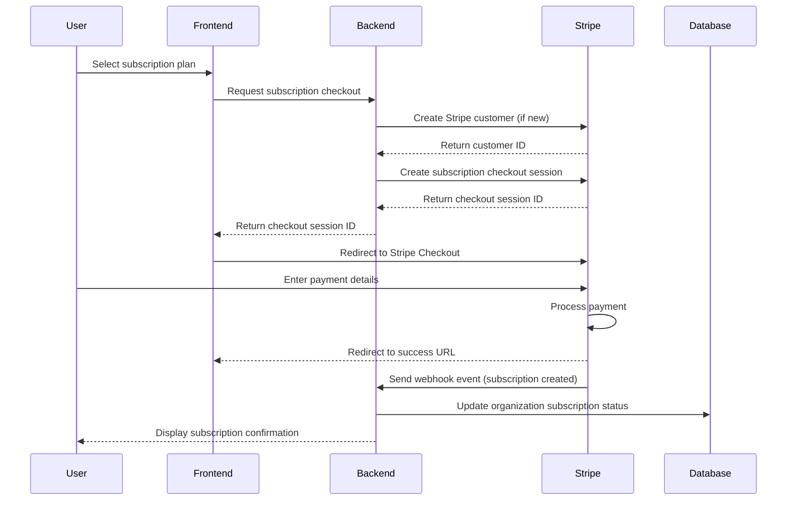
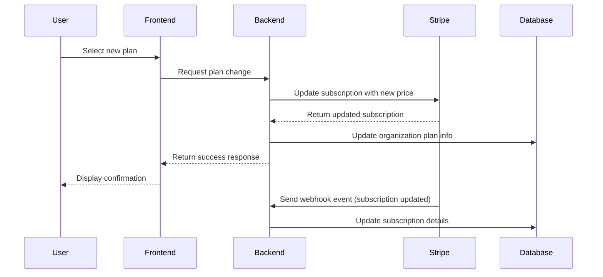
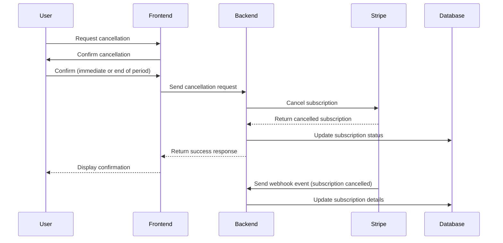

# Stripe Subscription Integration Implementation Plan

## 1. Technical Architecture

### 1.1 Overview

This document outlines the comprehensive implementation plan for integrating our pricing structure with Stripe's subscription API. The integration will enable us to offer tiered subscription plans, process payments, and manage the entire subscription lifecycle.

### 1.2 System Architecture


### 1.3 Core Components

1. **Subscription Plans Management**
   - Database schema for storing plan information
   - Admin interface for managing plans
   - Synchronization with Stripe Products and Prices

2. **Customer Management**
   - Linking organization accounts to Stripe customers
   - Storing and managing payment methods
   - Handling customer metadata and billing information

3. **Subscription Lifecycle**
   - Subscription creation, updates, and cancellation
   - Handling plan changes and billing cycle changes
   - Managing trial periods and grace periods

4. **Payment Processing**
   - Integration with Stripe Checkout and Payment Elements
   - Handling successful payments and failed payments
   - Managing invoices and receipts

5. **Webhook Handler**
   - Processing Stripe events (payment success/failure, subscription updates)
   - Updating local database based on Stripe events
   - Handling subscription status changes

6. **Super Admin Dashboard**
   - Organization management
   - Subscription plan configuration
   - Analytics and reporting

## 2. Database Schema Modifications

### 2.1 New Tables

#### 2.1.1 `subscription_plans`

```sql
CREATE TABLE subscription_plans (
  id UUID PRIMARY KEY DEFAULT uuid_generate_v4(),
  name VARCHAR(255) NOT NULL,
  description TEXT,
  type VARCHAR(50) NOT NULL,
  monthly_price DECIMAL(10, 2),
  annual_price DECIMAL(10, 2),
  features JSONB NOT NULL DEFAULT '{}',
  is_active BOOLEAN DEFAULT TRUE,
  is_custom BOOLEAN DEFAULT FALSE,
  stripe_product_id VARCHAR(255),
  stripe_monthly_price_id VARCHAR(255),
  stripe_annual_price_id VARCHAR(255),
  created_at TIMESTAMP WITH TIME ZONE DEFAULT NOW(),
  updated_at TIMESTAMP WITH TIME ZONE DEFAULT NOW()
);
```

#### 2.1.2 `subscription_transactions`

```sql
CREATE TABLE subscription_transactions (
  id UUID PRIMARY KEY DEFAULT uuid_generate_v4(),
  organization_id UUID NOT NULL REFERENCES organizations(id),
  amount DECIMAL(10, 2) NOT NULL,
  currency VARCHAR(3) NOT NULL DEFAULT 'usd',
  status VARCHAR(50) NOT NULL,
  stripe_invoice_id VARCHAR(255),
  stripe_payment_intent_id VARCHAR(255),
  invoice_pdf_url TEXT,
  created_at TIMESTAMP WITH TIME ZONE DEFAULT NOW(),
  updated_at TIMESTAMP WITH TIME ZONE DEFAULT NOW()
);
```

#### 2.1.3 `subscription_events`

```sql
CREATE TABLE subscription_events (
  id UUID PRIMARY KEY DEFAULT uuid_generate_v4(),
  organization_id UUID NOT NULL REFERENCES organizations(id),
  event_type VARCHAR(100) NOT NULL,
  event_data JSONB NOT NULL DEFAULT '{}',
  stripe_event_id VARCHAR(255),
  created_at TIMESTAMP WITH TIME ZONE DEFAULT NOW()
);
```

### 2.2 Modifications to Existing Tables

#### 2.2.1 `organizations` Table

```sql
ALTER TABLE organizations
ADD COLUMN plan_type VARCHAR(50) DEFAULT 'free',
ADD COLUMN subscription_status VARCHAR(50) DEFAULT NULL,
ADD COLUMN billing_cycle VARCHAR(10) DEFAULT 'monthly',
ADD COLUMN stripe_customer_id VARCHAR(255),
ADD COLUMN stripe_subscription_id VARCHAR(255),
ADD COLUMN billing_email VARCHAR(255),
ADD COLUMN billing_name VARCHAR(255),
ADD COLUMN billing_address JSONB,
ADD COLUMN tax_id VARCHAR(100),
ADD COLUMN subscription_start_date TIMESTAMP WITH TIME ZONE,
ADD COLUMN subscription_end_date TIMESTAMP WITH TIME ZONE,
ADD COLUMN trial_end_date TIMESTAMP WITH TIME ZONE,
ADD COLUMN subscription_plan_id UUID REFERENCES subscription_plans(id),
ADD COLUMN payment_failed_count INTEGER DEFAULT 0,
ADD COLUMN last_payment_date TIMESTAMP WITH TIME ZONE;
```

### 2.3 Indexes

```sql
CREATE INDEX idx_organizations_stripe_customer_id ON organizations(stripe_customer_id);
CREATE INDEX idx_organizations_stripe_subscription_id ON organizations(stripe_subscription_id);
CREATE INDEX idx_organizations_plan_type ON organizations(plan_type);
CREATE INDEX idx_subscription_transactions_organization_id ON subscription_transactions(organization_id);
CREATE INDEX idx_subscription_events_organization_id ON subscription_events(organization_id);
CREATE INDEX idx_subscription_events_event_type ON subscription_events(event_type);
```

### 2.4 Database Functions and Triggers

```sql
-- Function to update the updated_at timestamp
CREATE OR REPLACE FUNCTION update_updated_at_column()
RETURNS TRIGGER AS $$
BEGIN
   NEW.updated_at = NOW();
   RETURN NEW;
END;
$$ LANGUAGE plpgsql;

-- Trigger for subscription_plans
CREATE TRIGGER update_subscription_plans_updated_at
BEFORE UPDATE ON subscription_plans
FOR EACH ROW
EXECUTE FUNCTION update_updated_at_column();

-- Trigger for subscription_transactions
CREATE TRIGGER update_subscription_transactions_updated_at
BEFORE UPDATE ON subscription_transactions
FOR EACH ROW
EXECUTE FUNCTION update_updated_at_column();
```

## 3. User Flow Diagrams

### 3.1 Subscription Sign-up Flow



### 3.2 Subscription Upgrade/Downgrade Flow



### 3.3 Subscription Cancellation Flow



## 4. Webhook Implementation Requirements

### 4.1 Webhook Endpoints

Create a secure endpoint at `/api/webhooks/stripe` to handle all Stripe webhook events.

### 4.2 Events to Handle

1. **Subscription-related events**
   - `customer.subscription.created`
   - `customer.subscription.updated`
   - `customer.subscription.deleted`
   - `customer.subscription.trial_will_end`

2. **Payment-related events**
   - `invoice.payment_succeeded`
   - `invoice.payment_failed`
   - `invoice.finalized`
   - `charge.succeeded`
   - `charge.failed`

3. **Customer-related events**
   - `customer.created`
   - `customer.updated`
   - `customer.deleted`
   - `payment_method.attached`
   - `payment_method.detached`

### 4.3 Webhook Handler Implementation

```typescript
// Example webhook handler structure
export async function handleStripeWebhook(req, res) {
  const sig = req.headers['stripe-signature'];
  const endpointSecret = process.env.STRIPE_WEBHOOK_SECRET;
  
  let event;
  
  try {
    event = stripe.webhooks.constructEvent(req.body, sig, endpointSecret);
  } catch (err) {
    return res.status(400).send(`Webhook Error: ${err.message}`);
  }
  
  // Handle the event
  switch (event.type) {
    case 'customer.subscription.created':
      await handleSubscriptionCreated(event.data.object);
      break;
    case 'customer.subscription.updated':
      await handleSubscriptionUpdated(event.data.object);
      break;
    case 'customer.subscription.deleted':
      await handleSubscriptionDeleted(event.data.object);
      break;
    case 'invoice.payment_succeeded':
      await handleInvoicePaymentSucceeded(event.data.object);
      break;
    case 'invoice.payment_failed':
      await handleInvoicePaymentFailed(event.data.object);
      break;
    // Handle other events...
    default:
      console.log(`Unhandled event type ${event.type}`);
  }
  
  // Return a 200 response to acknowledge receipt of the event
  res.send({ received: true });
}
```

### 4.4 Webhook Security

1. Verify webhook signatures using Stripe's signing secret
2. Implement idempotency to handle duplicate webhook events
3. Set up proper error handling and logging
4. Configure retry logic for failed webhook processing

## 5. Super Admin Dashboard Specification

### 5.1 Organization Management

#### 5.1.1 Features

- View all organizations
- Create new organizations
- Edit organization details
- Suspend/reactivate organizations
- Delete organizations (with safeguards)
- View organization subscription details

#### 5.1.2 UI Components

- Organizations list with filtering and sorting
- Organization detail view
- Create/edit organization forms
- Confirmation dialogs for destructive actions

### 5.2 Subscription Plan Configuration

#### 5.2.1 Features

- Create new subscription plans
- Edit existing plans
- Set pricing (monthly/annual)
- Configure features included in each plan
- Activate/deactivate plans
- Sync plans with Stripe

#### 5.2.2 UI Components

- Plan list with status indicators
- Plan editor with feature configuration
- Pricing configuration (with currency support)
- Feature matrix editor

### 5.3 Custom Pricing Options

#### 5.3.1 Features

- Create custom plans for specific organizations
- Set custom pricing and billing terms
- Apply one-time or recurring discounts
- Create granular feature sets

#### 5.3.2 UI Components

- Custom plan creator
- Organization selector
- Discount configuration
- Custom feature selector

### 5.4 Billing Cycle Controls

#### 5.4.1 Features

- Configure billing cycle options (monthly/annual)
- Set up prorated billing for mid-cycle changes
- Configure grace periods for payment failures
- Set up trial periods

#### 5.4.2 UI Components

- Billing cycle configuration
- Proration settings
- Grace period settings
- Trial period configuration

### 5.5 Subscription Analytics

#### 5.5.1 Features

- Dashboard with key subscription metrics
- Revenue reports (MRR, ARR, churn)
- Plan popularity analytics
- Conversion and retention metrics
- Payment failure analysis

#### 5.5.2 UI Components

- Analytics dashboard with charts
- Filterable reports
- Export functionality (CSV, PDF)
- Date range selectors

## 6. Security Considerations

### 6.1 Payment Information Security

1. **PCI Compliance**
   - Use Stripe Elements or Checkout to avoid handling card data directly
   - Ensure TLS 1.2+ for all communications
   - Implement proper access controls for payment-related functions

2. **Data Protection**
   - Encrypt sensitive customer data at rest
   - Implement proper access controls for billing information
   - Follow data minimization principles

3. **API Security**
   - Use Stripe API keys securely (never expose in client-side code)
   - Implement proper authentication for all subscription-related endpoints
   - Use webhook signatures to verify webhook events

### 6.2 Subscription Data Security

1. **Access Controls**
   - Role-based access for subscription management
   - Audit logging for all subscription changes
   - IP restriction for admin functions

2. **Data Integrity**
   - Validate all subscription data before processing
   - Implement database constraints to ensure data consistency
   - Use transactions for critical operations

3. **Privacy Considerations**
   - Comply with GDPR, CCPA, and other privacy regulations
   - Implement data retention policies
   - Provide data export and deletion capabilities

## 7. Testing Strategy

### 7.1 Unit Testing

- Test individual components of the subscription system
- Mock Stripe API responses for predictable testing
- Test edge cases and error handling

### 7.2 Integration Testing

- Test the integration between our system and Stripe
- Verify webhook handling
- Test subscription lifecycle flows end-to-end

### 7.3 User Acceptance Testing

- Test the subscription UI flows
- Verify email notifications
- Test admin dashboard functionality

### 7.4 Stripe Test Mode

- Use Stripe test mode for all testing
- Test with Stripe test cards for different scenarios
- Simulate webhook events using Stripe CLI

### 7.5 Test Cases

1. **Subscription Creation**
   - Successfully create a subscription with valid payment method
   - Handle declined payment methods
   - Test free trial signup

2. **Subscription Updates**
   - Upgrade to a higher plan
   - Downgrade to a lower plan
   - Change billing cycle

3. **Payment Processing**
   - Successful payment processing
   - Failed payment handling
   - Retry logic for failed payments

4. **Cancellation**
   - Immediate cancellation
   - End-of-period cancellation
   - Reactivation of cancelled subscription

## 8. Implementation Timeline and Resources

### 8.1 Phase 1: Foundation (Weeks 1-2)

- Database schema modifications
- Basic Stripe API integration
- Subscription context and service layer

**Resources:**
- 1 Backend Developer
- 1 Database Administrator (part-time)

### 8.2 Phase 2: Core Functionality (Weeks 3-4)

- Subscription management UI
- Payment processing integration
- Webhook handler implementation

**Resources:**
- 1 Backend Developer
- 1 Frontend Developer
- 1 QA Engineer (part-time)

### 8.3 Phase 3: Admin Dashboard (Weeks 5-6)

- Super Admin dashboard implementation
- Plan configuration UI
- Analytics and reporting

**Resources:**
- 1 Backend Developer
- 1 Frontend Developer
- 1 UX Designer (part-time)

### 8.4 Phase 4: Testing and Refinement (Weeks 7-8)

- Comprehensive testing
- Bug fixes and refinements
- Documentation and training

**Resources:**
- 1 Backend Developer
- 1 Frontend Developer
- 1 QA Engineer
- 1 Technical Writer (part-time)

### 8.5 Total Resource Requirements

- Backend Developers: 1-2 (8 weeks)
- Frontend Developers: 1-2 (6 weeks)
- QA Engineers: 1 (4 weeks)
- Database Administrator: 1 (part-time, 2 weeks)
- UX Designer: 1 (part-time, 2 weeks)
- Technical Writer: 1 (part-time, 2 weeks)

## 9. Conclusion

This implementation plan provides a comprehensive roadmap for integrating our pricing structure with Stripe's subscription API. By following this plan, we will create a robust subscription management system that enables flexible pricing tiers, streamlined payment processing, and powerful administrative controls.

The phased approach allows for incremental development and testing, ensuring that each component is properly implemented and integrated before moving on to the next phase. The estimated timeline of 8 weeks provides sufficient time for development, testing, and refinement, while the resource requirements outline the necessary team composition to successfully complete the project.